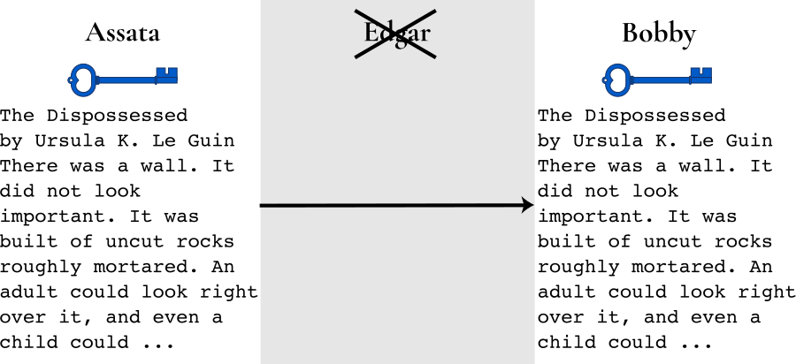

## Modern Cryptography

> We recommend that you read the Chapter on [What is Encryption?](1-1_cryptography.md) before reading this chapter.

#### What you'll learn

1. What key length means for security.
1. What open source software is and why it is important to security.

---

Modern cryptography is not something you do by hand. Computers do it for you and the details of the algorithms they employ are beyond the scope of this book. However, there are certain principles that will help you to better understand and evaluate modern digital security tools. 

### Security through requiring brute force attacks

Modern cryptographic protocols are designed to force an adversary (not
in possession of the cryptographic key) to spend (close to) as much
time as it would take to try every possible key to break the code.
Recall that trying every possible key is known as a "brute force
attack".  The parameters of a given protocol are chosen so that this
amount of time is impractical.  Usually, the most important parameter
is the length of the key.  Just as with the classic Vignère
cipher, longer keys mean that more possible keys must be explored in order to guess the
correct key.  As time goes by and computer processing becomes faster
and more powerful, often longer keys are required to guarantee that a
brute force attack would be infeasible.  For this reason, many
cryptographic protocols will mention the key size in terms of the
number of bits it takes to represent the key.

(Computers represent information, including cryptographic keys, in binary -- using just 0's and 1's.  Just like the numbers 0 through 9 represent the *digits* of a decimal number, the numbers 0 and 1 represent the *bits* of a binary number.  There are 10 x 10 x 10 = 103 = 1000 three digit decimal numbers -- the numbers 0 through 999.  Likewise, there are 2 x 2 x 2 x 2 = 24 = 16 four bit binary numbers.)

As an example, the AES cryptographic protocol may be referred to as AES-128 or AES-256 when using the protocol with 128 bit or 256 bit encryption keys, respectively.  In AES-128, there are 2128 = 340282366920938463463374607431768211456 possible keys.  In AES-256, there are 2256 = 115792089237316195423570985008687907853269984665640564039457584007913129639936 possible keys.  Trying every possible key, or even a small fraction of all possible keys, for AES-256 is computationally infeasible, even given the computational power of nation-states such as the United States.

### Security is not guaranteed through obscurity

Since as early as the 19th century, mathematicians have held as a standard that cryptographic schemes should be secure even if the method being used is not secret.  This is based on the following principle:  If security requires keeping the method secret, then one risks all messages that have ever been encrypted with or ever will be encrypted with that method being revealed, if the method is ever uncovered.  On the other hand, if your method only requires keeping the key secret, then one only risks those messages that have been encrypted with that particular key being revealed, if the key is compromised.

### Security is provided by transparency

In fact, the more transparency around a cryptographic method, the more
you can trust the security of the method.  To understand this,
consider the how an encryption program (or any computer program, in
fact) is created.  It starts with an algorithm as to how to perform
the encryption.  A programmer turns this algorithm into *source*
computer code.  A computer compiles this source code into the program
or app that runs on your computer or phone.

A good computer programmer should be able to translate from an
algorithm (1) to source code (2) and back. A security professional would
be able to evaluate the security of a cryptographic protocol based on
the algorithm, but should also evaluate the source code to be certain
of its faithful implementation (that there are no mistakes or *bugs*,
whether intentional or not).  However, as a user, you would only have
access to the compiled program (3).  Unfortunately, given only the
compiled code, it is impossible for anyone to recreate the source
code.

So, unless the source code is available, no one can be certain that the security claims of an app are true.  On the other hand, having just the compiled program is enough for a hacker to try and break the security of the app.  Many software projects make their source code available to the public: such software is called *open source software* and includes many well known projects security and otherwise, such as Signal, Firefox and Linux.  The alternate is *closed source software* and is popular among projects that aim to monetize their product through sales of propietary software, such as Safari, internet Explorer, Windows and Mac OS.  While it is possible to evaluate the security of closed source software (through, for example, private audits), it is much more difficult to maintain this on an ongoing basis.  Open source projects are open to scrutiny by anyone, giving every opportunity for security (or other) problems to be discovered.

### Security is provided by protecting your encryption key

Since the encryption method is typically public in modern
cryptographic protocols, the way that one achieves security is
through protecting their encryption key.  What this looks like in
practice depends on where the key resides.  In the case of Signal
Private Messenger, the encryption key is a file on your phone and it
is protected by protecting your phone.  In the case of a password
manager that syncs your passwords to the cloud, the
key that encrypts the file storing all your passwords is derived from or protected by 
the password that you use to log into your password manager.

### Security is provided by distrusting the infrastructure

End-to-end encryption involves scrambling a message so that it can only be read by the endpoints of a conversation.  But here's where confusion comes in -- what are the endpoints?  Are they just you and your friends?  Or is the server an endpoint too? It depends on the application.  As an example, HTTPS (which secures communications between you and the servers hosting the webpages you visit) is encrypted so that only you and the server can decrypt the content of the webpages.  Signal, a secure instant messaging app tied to your smart phone, encrypts messages so that only you and your friend that you are messaging can read your messages.  In both cases, only the people or entities that you could imagine needing to know the information are able to decrypt encrypted information.  This is the heart of end-to-end encryption.

Here is an illustration of why end-to-end encryption is so important in private messaging.  This is covered in greater technical detail in the Chapter on [The Man in the Middle](man-in-the-middle).  Assata (left) is trying to get a message (Ursula K. Le Guin’s the Dispossessed) to Bobby (right) over the internet:

But the ghost of mean old J. Edgar Hoover haunts the infrastructure. The Man in the middle here is able to intercept, read, and change any unprotected message sent between our two friends. Like so:

(Edgar could also just read and send the message along unaltered).  To make matters worse, saying that an app uses "encryption" (without being specific about who holds the keys) doesn't guarantee that messages remain private and authentic.  For example, if a server between the two comrades is managing the encryption keys, anyone with access to the server could read and modify all messages between them.  However, if Assata and Bobby are encrypting their message (with the blue key), then Edgar won't be able to read the message, and wouldn't be able to replace the message with one that can be decrypted with the blue key:

How do you know whether an application uses end-to-end encryption?
The best indication is that there is some way to verify encryption
keys -- Signal makes this easy with safety numbers.  We will describe this in more detail in the Chapter on [Cryptographic Signing](1-8_authenticity).

Another way to reduce exposure to a malicious interloper is through peer-to-peer messaging, where it is said that there is "no server" in between, managing your messages or contacts.  Even this can be a bit misleading, however: there is a tremendous amount of internet infrastructure in between you and your friends, it's just invisible to most users and apps.  As illustrated above, this infrastructure is precisely what the State exploits to conduct undetectable suspicionless, mass surveillance.

### In context: The Enigma machine

Possibly the first modern encryption techniques were used during WWII.  Predating modern computers, the protocols were supported by sophisticated mechanical devices.  Most notable among these is the Enigma machine used by Nazi Germany.  The Enigma is an electro-mechanical device that allowed you to set a particular key, type in the plaintext and get the ciphertext output.  With the same key, typing in the ciphertext would output the original plaintext.

 ](https://upload.wikimedia.org/wikipedia/commons/thumb/3/3c/Four-rotor-enigma.jpg/504px-Four-rotor-enigma.jpg "Enigma machine, courtesy of Greg Goebel, [Public Domain](https://commons.wikimedia.org/w/index.php?curid=34042)2")

The key is an order of the rotors and initial positions of the rotors (pictured above).  Standard operation required using a new key every day.  The keys were listed by day in handbooks distributed to operators of Enigma machines -- these are essentially one-time pads of keys.  Incidentally, these were printed with water soluble ink, allowing quick destruction of the key book when they became at risk of falling into enemy hands.

Much effort went into breaking Engima-encrypted messages.  Several machines were captured during WWII, but even in possession of the machine, decrypting messages was nearly infeasible (as with truly modern ciphers whose methods are public).  Alan Turing, a founder of computer science as a discipline, worked at the secretive Bletchly Park, the central site for British codebreakers during WWII.  Turing designed the *bombe*, a type of computer specially designed for deciphering Enigma messages.  The bombe was not enough.  (In fact, decrypting Enigma messages without a key is incredibly challenging even with modern computation capabilities -- at least one famous Enigma message intercepted during the war remains encrypted to this day.)  However, the bombe in combination with the fact that most early morning messages contained weather reports or the phrase *Keine besonderen Ereignisse* or "nothing to report", did allow the Allies to break Enigma enciphered messages regularly.

Turing's work during the war has been estimated to shorten the war by more than two years.  However, his work remained unacknowledged throughout his life, since work at Bletchley Park was classified, and in fact, he was criticized for not contributing to the war effort.  More tragically, as a gay man, he was persecuted by his own government to the point to criminal charge in 1952.  Found guilty of homosexual acts, he was given the choice of chemical castration or imprisonment.  Choosing the former, he only lived another two years, reportedly ending his own life by cyanide poisoning.

#### What to learn next

* [Exchanging Keys for Encryption](1-3_key-exchange.md)

#### External resources

* [Kerckhoffs' principles from *La cryptographie militaire*](http://petitcolas.net/kerckhoffs/) is the original formulation of not requiring obscurity to guarantee security.

