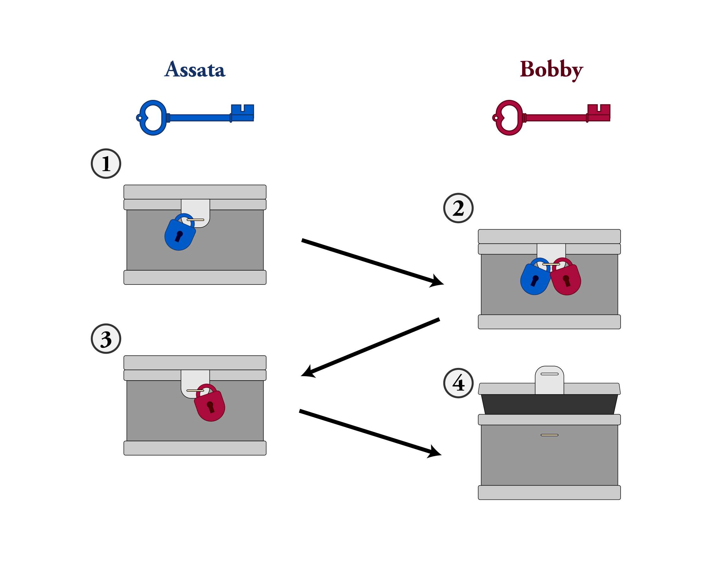
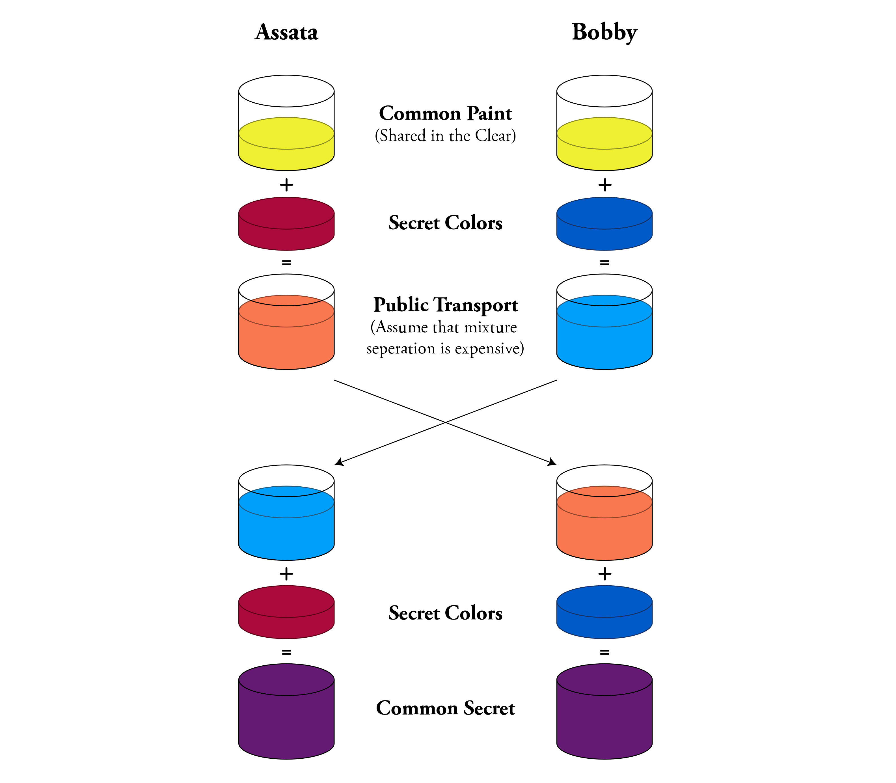
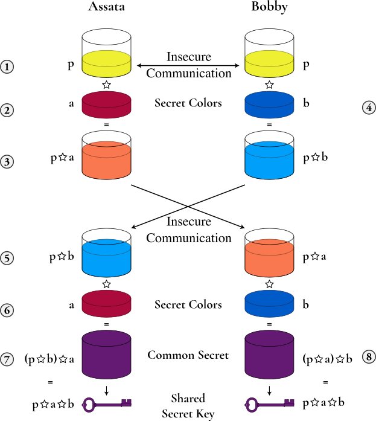

## Exchanging Keys for Encryption

> We recommend that you read the Chapter on [Modern Cryptography](1-2_modern-cryptography.md) before reading this chapter.

#### What you'll learn

1. How messages can be encrypted without sharing an encryption key in advance.
1. The primary method of exchanging keys online used today.

---

Eavesdropping communications through the internet can done at many points: the wifi hotspot  you're directly connected to; your internet service provider; the server hosting the webpages you visit; national gateways; and the vast array of routers and switches in between. 

Without encryption, all these communications would be readable by an eavesdropper, be that a stalker, a hacker, or a government agency. But in order to encrypt your communications, you need to agree on a key with the party you are communicating with.  If you are visiting a website, how do you safely exchange a key with the server that hosts the website?  We need a method for two parties (e.g., two people, a person and a server, or two servers) to efficiently agree on a key without meeting and while only being able to communicate over insecure channels, such as the internet.

### A physical example: Exchanging a message without exchanging a key

First consider a physical example, illustrated below.  Suppose Assata wants to send Bobby
a package.  She puts it in a strong box with a large clasp that can
take multiple locks (1).  She puts a lock on the box, but Bobby doesn't
have a key to the lock.  Assata mails the box to Bobby, who cannot
open it (and neither can anyone else while the box is in transit).
Bobby puts his own lock on the box (2), a lock that Assata doesn't have
the key to. When Assata
receives the box, she removes her lock and sends the box back to
Bobby (3).  Now Bobby can open the box because it is only secured with his
lock (4).  The box cannot be opened in transit - an eavesdropper
would have to break Assata's lock or Bobby's lock, or both.  



This illustrates that it is possible to send something securely without meeting first to exchange (agree on) a key.  However, we aren't about to start physically mailing lock-boxes in order exchange encryption keys.  What we need is a mathematical version of this that we can use for digital communications.

### A mathematical example: Exchanging a message without exchanging a key

Let's see how we would do this without physical boxes and locks.  Suppose you have an encryption protocol where you can encrypt any text (as we always expect), that you can apply multiple times for *layers* of encryption (as we also always expect), and that you can encrypt and decrypt the layers in any order you wish and end up with the same result. A mathematical operation satisfying this last property is said to be *commutative*.  (All the encryption protocols we describe in the Chapter on [What is Encryption?](1-1_cryptography.md) are commutative.)  Let's see this with an example, using the Vigen&egrave;re cipher.

Assata encrypts the message

```AT ONE TIME IN THE WORLD THERE WERE WOODS THAT NO ONE OWNED```

with a Vigen&egrave;re cipher and key `ALDO` to get the ciphertext

```AE RBE ELAE TQ HHP ZCRWG HHPUS WPUS WZRRS EKOT YR CNP RKNPG```

and sends the result to Bobby.  Bobby doesn't have the key!  But Bobby encrypts this ciphertext with a Vigen&egrave;re cipher and key `LEOPOLD` to get the doubly-encrypted text

```LI FQS POLI HF VSS KGFLU SKAYG LDFV HDFGG PNZX MG QYS COBEU```.

and sends the result back to Assata.  Assata "decrypts" the message from Bobby with her key (`ALDO`) to get (the still encrypted message):

```LX CCS ELXI WC HSH HSFAR EKPVS LSCH HSCSG EKLX BD CYH ZABTR```

and sends the result to Bobby.  Finally, Bobby decrypts this with his key (`LEOPOLD`) and gets the message that Assata wanted to send Bobby in the first place:

```AT ONE TIME IN THE WORLD THERE WERE WOODS THAT NO ONE OWNED```.

Note that, in this example, Assata did not share her key (`ALDO`) with anyone and Bobby did not share his key (`LEOPOLD`) with anyone either.  Because the Vigen&egrave;re cipher is commutative, it did not matter that the message was encrypted with Assata's key, then encrypted with Bobby's key, then decrypted with Assata's key and finally decrypted with Bobby's key.  All that matters is that the message was encrypted and decrypted once with each key.  Any eavesdropper would only see one of the three intermediate ciphertexts.

### A physical example: Agreeing on a secret over an insecure channel

In modern cryptographic systems, rather than sending the entire message back and forth with different layers in this way, one has an initial exchange, much like in the above examples, to settle on a key to use for the intended communication. You could imagine that Assata, rather than sending the message ```AT ONE TIME IN THE WORLD...```, sent an encryption key to use for a longer communication.  We will describe the mathematical basis for key exchange as it is used by almost all modern communication, called "Diffie-Hellman key exchange".

First, let's see how this is done with paints instead of mathematics (illlustrated below).  We will assume that if you mix two colors of paint together, you can't unmix them: specifically, even if you know what one of the two colors was, you can't figure out what color was mixed with it to get the resulting mixed color.



Assata and Bobby start by agreeing on one paint color (in this example, yellow) and an amount, say 10mL (1).  They can do this over an insecure communication channel and should assume that an eavesdropper will know what the color and amount is too.  Then Assata picks a color (in this case, rusty orange) and keeps it secret (2). She mixes 10mL of yellow with 10mL of rusty orange to get a coral-ish color (3).  She sends this to Bobby, over the insecure channel, understanding that an eavesdropper will see it.  Bobby does the same thing, with his own secret color (4).

Now, to the paint sample received from Bobby (5), Assata mixes in 10mL of her secret color (6), resulting in a dark purple (7).  Bobby does the same thing.  Assata's unpleasant browndark purple is obtained from a mix of 10mL each of yellow, her secret color and Bobby's secret color.  Bobby's resultant paint mix is obtained from a mix of 10mL of yellow, his secret color and Assata's secret color.  So Bobby also ends up with the same unpleasant browndark purple (8)!  Can the eavesdropper create the dark purple?  The eavesdropper sees yellow (1), the mix of yellow and Assata's secret color (3), and the mix of yellow and Bobby's secret color (5).  But to create the unpleasant brown, the eavesdropper would have to unmix in order to obtain Assata or Bobby's secret color, which they can't do.

### Diffie-Hellman key exchange

Let's revisit this process mathematically.  We do so with a commutative mathematical operation that is hard or impossible to reverse.  A mathematical operation or function that is hard to reverse is called a one-way function. Let's represent our mathematical operation with the symbol &#x2606;.  That is, a&#x2606;b = c for some numbers a, b, and c.  Commutative means that a&#x2606;b = b&#x2606;a.  That &#x2606; is one-way means that if you know b and c, you cannot easily figure out what a is.  In practice, one should only be able to figure out what a is by a brute force (or close to brute force) attack: by trying every possibility for a.  You may think of &#x2606; as multiplication (which is commutative but is *not* one way).  (For those mathematically inclined, &#x2606; can be modular exponentiation for real implementations of Diffie-Hellman.)

Illustrated below, Assata and Bobby agree on a number p which is public (1).  Assata chooses a secret number a (2), computes p&#x2606;a (3) and sends the result to Bobby.  Since &#x2606; is one-way, an eavesdropper will know p and p&#x2606;a, but will not be able to (easily) determine a. Bobby chooses a secret number b (4), computes p&#x2606;b and sends the result to Assata (5). An eavesdropper knows p&#x2606;b, but not b. Assata computes (p&#x2606;b)&#x2606;a (7), using the message from Bobby (5) and her own secret number (6). Bobby computes (p&#x2606;a)&#x2606;b (8) , using the message from Assata (3) and his own secret number (4).  Since &#x2606; is commutative (p&#x2606;b)&#x2606;a=(p&#x2606;a)&#x2606;b and so Assata and Bobby now have computed a common number.  Since the eavesdropper only knows p&#x2606;a, p&#x2606;b, and p, and since &#x2606; is one-way, the eavesdropper has no efficient means of computing Assata and Bobby's shared common number: it is secret to Assata and Bobby.  Assata and Bobby can use this shared number as their cryptographic key.



### Using Diffie-Hellman key exchange

Diffie-Hellman key exchange is used *all over the place* as a means of agreeing on a cryptographic key.  It is used as the basis for most forms of encrypted communications that you will encounter.  Most notably, it forms the basis of key exchange when you connect to a website via https.  When you visit a website, the url will either start with http:// or https://.  In the former case, none of your communications with the server of the website are encrypted.  In the latter, communications are encrypted, and the key used to encrypt those communications is generated using Diffie-Hellman key exchange.

### In context: When good things go bad

Remember that the first thing that Assata and Bobby do is agree on a number p that forms the basis of their key exchange.  This number is public, but we assumed that our mathematical operation &#x2606; was one-way, so it was okay for p to be public. However, someone with a lot of computational resources (such as a wealthy nation-state), can invert the operation &#x2606; (for functions such as modular exponentiation used for &#x2606; in the real world) using two phases.  The first phase takes a very long time and must be done for a specific value of p.  The second phase can be done very quickly (in real-time) for the same value of p, assuming that the first phase has been completed.  This means that everyone *should not* be using the same value p, but should be using different values of p and changing them often.

However, in 2015, researchers showed that 18% of the Top 1 Million HTTPS domains use
the same value of p.  Two other communication protocols that depend on Diffie-Helman key exchange are SSH (secure shell) and VPN (virtual private network).  The same researchers showed that 26% of SSH servers and 66% of VPN servers used the same value of p in their Diffie-Helman key exchange.  This means that a powerful adversary would have little trouble breaking the encryption.

While the Diffie-Hellman protocol is strong and reliable, this highlights that those who implement the protocols need to do so with care to ensure that they are in fact secure.

#### What to learn next

* [The Man in the Middle](1-5_man-in-the-middle.md)
* [Public Key Cryptography](1-7_public-key-cryptography.md)

#### External resources

* [Weak Diffie-Hellman and the Logjam Attack](https://weakdh.org/)
