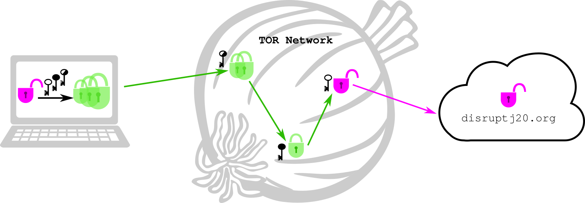
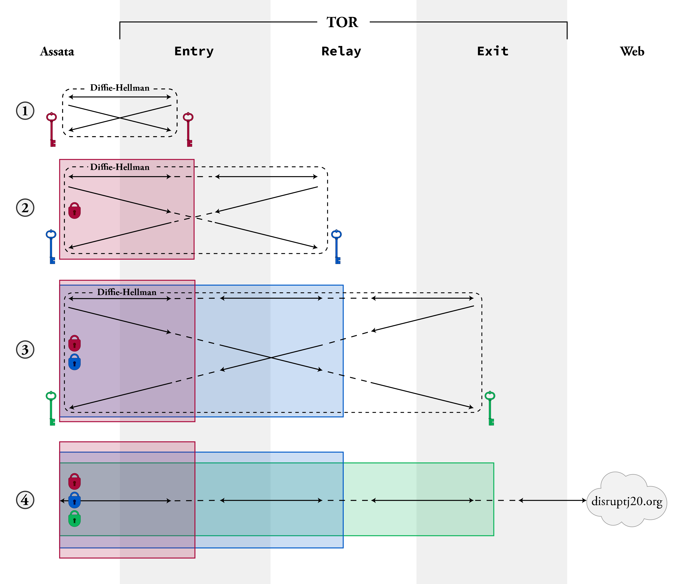

## Anonymous Routing

> We recommend that you read the Chapters on [Metadata](1-9_metadata.md) and [Exchanging Keys for Encryption](1-3_key-exchange.md) before reading this chapter.

#### What you'll learn

1. Who has access to what on the internet.
1. Technologies that allow for anonymous communications online.
1. What anonymity is and pitfalls of anonymity.

---

In order to communicate online, packets of information need to be
addressed to your computer, whether that information is from an
instant messaging conversation, an email, or browsing the web.  In
this section, we mostly focus on web browsing, although the
same ideas apply in most settings.  Your computer's address, or IP
address, is how internet communications reach your computer, in the same way as a mailing address on an envelope or package.  For that
reason, your computer's current IP address (which changes depending on
where you are connecting to the internet) is related to your physical
location.  How refined that physical location is depends on how much
information the internet Service Provider (ISP) reveals, and to whom
they are willing to reveal it.  The ISP knows which cable or phone
line or cell tower you are receiving internet traffic through, but may
only provide zip code information to the proliferation of IP
geolocation websites.  Or they may provide the location of a specific
house.

Your IP address is just one piece of meta-data that is necessary in
order to get information to your computer.  When browsing the web,
though, a lot of other meta-data, while not strictly necessary, is
transmitted to "maximize your browsing experience."  This information
includes details such as what browser plugins you use, your time zone,
and your screen size, and can be used as a unique identifier across IP
addresses that you use to connect to the internet.

Who has access to all this meta-data which can be used to identify
you?  Without encryption, such as using
https,
any eavesdropper would have access to this meta-data, as well as the
content of your communications.  Encryption will protect some meta-data from your ISP and eavesdroppers (such as which browser you are using),
but not your IP address and not the web domains you are
visiting.  And of course, the servers of the websites you are visiting
will have access to your meta-data, as well as any content.

But since meta-data is used to get information to you, is there any way to protect this meta-data, and who could you protect it from?  We describe two ways to anonymize your web browsing.

### Trusting a middle man: Virtual Private Networks

Virtual Private Network (VPN) technology began as a means to extend a local network (such as a university's or company's network) to remote locations (such as off-campus housing and home offices) so that no matter where you were you could access the same resources as you would if you were on the local network (such as library and software subscriptions).  While connected to a VPN, a webpage host will see the IP address of the local network the VPN is extending *as your address* the IP address of your home.  For this reason, VPN use has become popular for anonymizing your location.

A VPN operates as a (hopefully benign) middle man (illustrated below).
Rather than sending all her web requests directly, Assata sends all
her web requests to her VPN, the VPN sends fetches her request from
the internet for her, and then the VPN sends the results back to
Assata.  The specifics of how this is done vary between different VPN
services, but generally the communications between you and the VPN are
encrypted.  The protective quality of a VPN relies on many other
people also connecting to that VPN.  An eavesdropper looking at
communications to and from the VPN will be able to identify the
individuals connecting to the VPN and the web requests the VPN is
fetching, but ideally will be unable to match those web requests with
the corresponding users because there are two many simultaneous requests in and out of the the VPN.

Of course, the VPN provider knows all of your internet behavior, and
with their cooperation, an adversary would too: you are trusting your
VPN provider with that information.  However, your ISP (without using
a VPN) has access to the same information: you are putting the same
trust in your VPN provider as you must in your ISP.  The difference is
that your ISP does not conceal your IP address from destination
servers on the internet while a VPN does.  Some
increased privacy risk, however, comes with using the same VPN across
many connection locations (e.g. home, work, coffee shop), giving a single entitiy (that VPN) a more complete
view of your internet use than available to the ISP at each location.

### Not trusting the middle man: The Onion Router

The Onion Router, or Tor, is a means of accessing the internet anonymously while sidestepping trust issues.  Rather than using one middle-man, with whom you trust all your information, you use (at least) three intermediaries, chosen at random from a selection of thousands of volunteer servers (illustrated below).  Traffic through this path of intermediaries is encrypted so that the first (entry) node only knows that you are accessing the internet via Tor, the second (relay) node only knows that someone is accessing something on the internet via Tor (but not who specifically or what specifically) and the last (exit) node only knows that a certain webpage (for example) is being requested by a Tor user (but not which Tor user).

The way this is done is by Diffie-Hellman key exchanges first with the entry node, then with the relay node and finally with the exit node as follows (and illustrated below).
1. Assata establishes a cryptographic key that she shares with the entry node (which we will call the entry key, in red).  This establishes an encrypted communication channel between Assata and the entry node.
2. Assata uses this encrypted channel to communicate with the relay node via the entry node.  The traffic between the entry and relay nodes is not encrypted, but Assata uses the channel via the entry node to establish a cryptographic key that Assata shares with the relay node (the relay key, in blue).  All that the relay node knows is that it is setting up a shared key with *some* Tor user, but not the identity of that Tor user.
3. This process is repeated to establish an encryption key that Assata shares with the exit node (the exit key, in green).
4. This created a sequence of keys (red, blue, green) that allow for encryption between Assata and the entry, relay, and exit nodes, respectively.

For Assata to send a request to disruptj20.org, she encrypts the request, addressed to disruptj20, with the green key and addresses this to the exit node; she wraps this in a message addressed to the relay node and encrypts this with the blue key; she wraps this in a message addressed to the entry node and encrypts this with the red key.  The message is sent to the red node.  The first *layer* of encryption is removed by the entry node (with the red key that the entry node shares with Assata), revealing a message addressed to the relay node.  The second *layer* of encryption is removed by the relay node (with the blue key that the relay node shares with Assata), revealing a message addressed to the exit node.  The third *layer* of encryption is removed by the exit node (with the green key that the exit node shares with Assata), revealing a message addressed to disruptj20.org, which the exit node forwards along.  This is illustrated in (1) below.

For disruptj20.org to send information back to Assata, the web server sends the information back to the exit node.  The exit node encrypts with the green key and sends to the relay node.  The relay node encrypts with the blue key and sends to the entry node.  The entry node encrypts with the red key and sends to Assata.  Assata can remove all three *layers* of encryption because she has all the necessary keys.

The Onion Router gains its name from these *layers* of encryption (because onions have layers).

In order to recreate your path through the Tor network and therefore your web request, your adversary would need to control all three nodes that you select as your entry, relay and exit nodes.  Even an adversary who controls 80% of the Tor network would only have a 50% chance of controlling all three nodes that you select.  Since there are thousands of Tor nodes (that anyone can volunteer to operate), this is unlikely.

An alternate attack that an adversary could take would be a *confirmation attack*.  In this scenario, the adversary is trying to prove that you have visited a particular web service.  If they can access your web traffic (through your ISP, for example) and the web traffic of the target web service (through legal or extra-legal means) then your adversary may be able to match up your use of Tor to accesses to the web service from Tor based on their timing.  This type of correlation was used in the case against Jeremy Hammond, convicted for hacking activities conducted by an Anonymous collective.

Other attacks have been made on Tor too, but the Tor project is very responsive to improving their technology to improve their security.  We discuss obstacles to anonymous browsing below and pitfalls a user may run into as well as best practices when trying to access the web anonymously in the Chapter on [Protecting your Identity](3-5_apac.md).

### Use and prevention of anonymous browsing technologies

Many people in countries where censorship of the internet is common, such as China and Iran, use VPNs and Tor to access the uncensored web.  On the other hand, evidence of VPN traffic can be gleaned from the meta data of internet communications, and governments can use this to block all such communications, as has been done in China and Syria in their censorship efforts.  Other countries, such as Iran are known for blocking access to specific VPN providers that are not sanctioned by the government.

Tor as a whole can be blocked from use (e.g. by a government) since Tor nodes are publicly listed.  This is done by simply blocking all traffic addressed to the Tor nodes.  This this is overcome by use of *bridges*, a set of not-publicly listed Tor nodes, which you use in lieu of a publicly listed entry node.  To get access to a small set of bridge nodes, you need to email the Tor project from a restricted email account, (such as Google, Riseup! or Yahoo) to request one.  Tor can also be blocked by packet inspection; that is, by looking at the meta-data of the communications (as with VPN traffic).  The Tor project makes this process challenging by using methods of obfuscating Tor internet traffic so that it doesn't look like Tor traffic.

VPN and Tor are also used to gain access to particular sites that might not be available in your jurisdiction because of a choice of the webhost.  This is common for many media platforms, such as Hulu and Netflix.  To this end, companies will often block access to content from known VPN service providers or from Tor exit nodes.

### In context: disruptj20

On January 20, 2017, mass protests erupted around the inauguration of the 45th President of the US.  Much of the organizing for those events was coordinated on the website disruptj20.org.  In August 2017, it came to light that the US Department of Justice had issued a warrant to the disruptj20.org webhost, DreamHost, requesting, among other items, "all HTTP request and error logs", which would include the IP addresses of all individuals, purported to be 1.3 million people, who visited the website, along with which subpages they visited, how often they did so, and any text a visitor may have typed into the webpage.

Of course, anonymous browsing technologies would have protected the IP addresses of visitors to that site.

#### What to learn next

* [Protecting your Identity](3-5_apac.md)

#### External resources

* [Jeremy Hammond: Tor activity](https://www.documentcloud.org/documents/1342115-timeline-correlation-jeremy-hammond-and-anarchaos.html) FBI surveillance of Jeremy Hammond's Tor activit, March 1-4, 2012.
* [The Great Firewall of China](http://www.greatfirewallofchina.org/) keeps track of which and how many or how many times sites are censored in China.
* [Search Warrant to DreamHost](https://www.dreamhost.com/blog/wp-content/uploads/2017/08/DH-Search-Warrant.pdf), August 2017.
