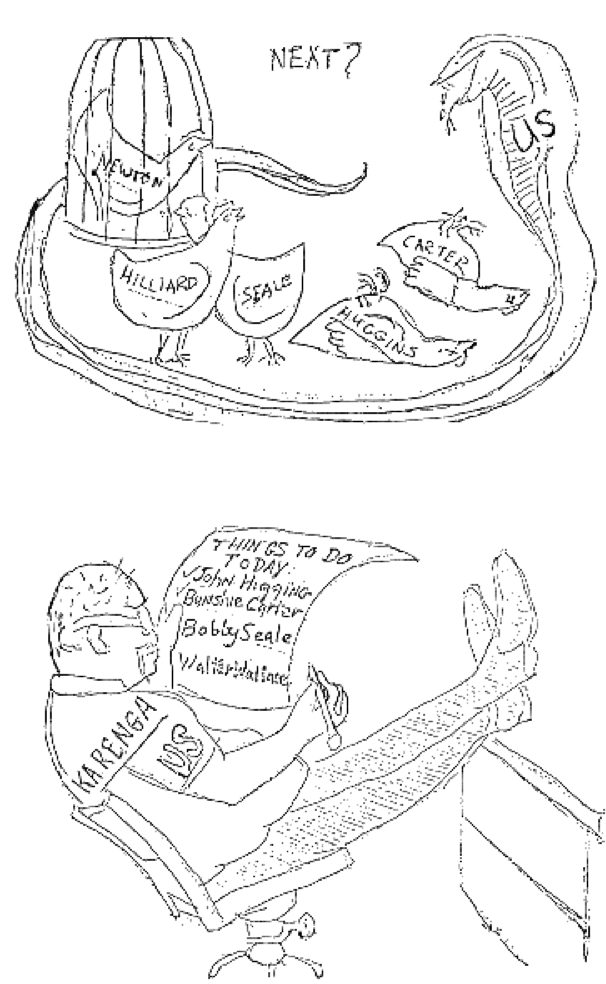

## Mechanisms of Social Movement Suppression

> Before reading this chapter, it's a good idea to (re)read the Introductory Chapter [Why Digital Securtity](0-1_intro.md) and recall that our primary focus in this book is US social movements.

#### What you'll learn

1. How the US suppresses social movements.
1. What COINTELPRO was and the mechanisms employed to suppress social movements of that era.

---

The US has a long history of interference, including on its own soil
in the form of suppressing the efforts of social movements, and
particular, liberatory and left-political social movements.  Labor
organizing, independence, civil rights and environmental movements
have all been subject to opposition by the US government, often at the
behest of or in cooperation with large corporations.

In trying to grapple with the risks associated with a social movement
*not* attending to digital security, it is helpful to look at how the
State has interfered with social movements in the past.  This history
can be overwhelming, and it can be tempting to dismiss this as
something that has happened in the past but that is not happening now.
Going through this history can also lead to defeatism, especially in
light of the additional digitally-enhanced tools that the State can
employ against an adversary (percieved or actual).

However, since we should not condemn ourselves to repeat mistakes of
the past, we need to attend to enough history to learn appropriate
lessons that our movements may be successful moving forward.  In order
to do so without turning this into a history textbook, we draw on the
scholarship of Jules Boykoff who categorized the ways in which the US
has messed with social movements in the 20th century. Boykoff
enumerated 12 *modes of suppression*, which we compress to 7 in this
presentation.

Understanding these historical modes will allow us to predict how
digital surveillance could support or enhance those
modes, as we will discuss on the Chapter on [Digital Threats to Social Movements](2-02_digital-threats.md).  But more importantly, we will be
able to see how encryption and attending to digital
hygeine can protect social
movements against (some of) these oppositional forces, as we will cover in [Part III](index.md) of this book.

### Modes of suppression

These are 7 ways in which the US has suppressed and continues
to suppress social movements, each with a few examples of their use.
Unfortunately, these examples are far from exhaustive.

#### 1. Direct violence

Beatings, bombings, shootings, and other forms of violence are carried out
by the State or other institutions or nodes of power against dissident
citizens.

This may be the result of the policing of large groups (such as when
the Ohio Army National Guard fired at students during an anti-war
protest at Kent State University, killing 4 people and injuring 9
others) or targeted assassinations (such as in the FBI-organized
night-raid shooting of Black Panther Party leader Fred Hampton).  To
risk an understatement, these actions discourage participation in
social movements for fear of life and limb.

#### 2. The legal system

The legal system allows for harassment arrests, public prosecutions &
hearings, and extraordinary laws that are used to interfere with
individuals in biased fashions.  The State arrests activists for minor
charges that are often false and sometimes based on obscure statutes
that have remained on the books, buried and dormant but nevertheless
provide vessels for selective legal persecution. Public prosecutions
and hearings can land dissidents in jail or consume their resources in
legal proceedings that sidetrack their activism and demobilize their
movements. Current supporters and potential allies are discouraged
from putting forth dissident views. Prosecution and hearings
publicized in the mass media reverberate outward into the public
sphere. Another form of legal suppression, the State promulgates and
enforces exceptional laws and rules to tie up activists in the
criminal-justice labyrinth. This is the legal system being used to
squelch dissent.
    
Controversial "stop & frisk" programs allow police officers to briefly
detain and at times search people without probable cause.  "Free
speech zones" greatly limit the time, place and manner of protests.
Those arrested at First-Amendment-protected protests on the
inauguration of Donald Trump faced public prosecutions that were
unlikely to ever reach a conviction.  And certain crimes, such as
arson or destruction of property, are elevated to terrorism when they
are accompanied by a political motive and allow for the State to
greatly increase the punishment doled out.  Other laws are
specifically tailored to prevent activism, such as "Ag Gag Laws" which
criminalize the filming of agricultural operations (which is done to
expose abuse of animals).

#### 3. Employment deprivation

One's political beliefs can result in threats of or actual loss of
employment due to one's political beliefs or activities. Some
dissidents are not hired in the first place because of their political
beliefs.  This is typically carried out by employers, though the State
can have powerful direct or indirect influence.

Recently, we have seen university professors forced out of their jobs
or have a job offer revoked, as with Steven Salaita, whose offer of
employment as a professor of American Indian Studies was withdrawn
following university donor objections to a series of Tweets critical
of Israel and of Zionism.  For several years (but since struck down by
a federal court), government contractors in Texas were required to
sign a pledge to not participate in the pro-Palestinian Boycott,
Divestment, and Sanction movement or have their contracts canceled;
this resulted in the firing of an American citizen of Palestinian
descent who worked as a school speech pathologist and refused to sign
the statement.

#### 4. Conspicuous surveillance

Conspicuous surveillance aims not primarily to collect information
(which is best done surreptitiously), but to intimidate.  This is
intended to result in a "chilling effect" in which individuals guard
their speech and action out of fear of reprisal.  It may drive away
those engaged in activism or make it difficult to encourage new
activists.  Although the chilling effect has been deemed
unconstitutional, it is difficult to prove harm in a court (as
required), so it is a safe means of suppression (from the perspective
of the surveiller).

The FBI has a long history of "knock and talks" or simply visiting the
houses of dissidents and activists (and those of their families and
employers) to "have a chat" in order to let people know that they are
being watched.

#### 5. Covert surveillance

Surveillance might be concentrated or focused as with the use of
spies, targeted wiretaps and subpoenas or warrants for data, the use of
infiltrators (covert agents who become members of the target group),
or the use of informants (existing group members who are paid or
threatened in order to extract information). Surveillance might also
be diffuse, such as the accumulation, storage, and analysis of
individual and group information that is obtained through internet
monitoring, mail openings, and other mass surveillance techniques.

The scale of the FBI informant program is sizeable, having over 15,000
informants in 2008.  In the wake of 9/11, FBI and large law
enforcement agencies such as the NYPD turned their intelligence
programs against Muslim-American communities.  This included: the
close surveillance of lawyers, professors and the executive director
of the largest Muslim civil rights organization in the US (the Council
on American-Islamic Relations) by the FBI; the NYPD singled out
mosques and Muslim student associations, organizations and businesses,
through the use of informants, infiltrators and surveillance with the
supposed rationale of identifying potential "terrorists" which
included looking for "radicalization indicators" include First
Amendment-protected activities including such as "wearing traditional
Islamic clothing [and] growing a beard" and "becoming involved in
social activism."

#### 6. Deception

Snitch-jacketing is when a person (often an infiltrator) intentionally
generates suspicion that an authentic activist is a state informant or
otherwise maliciously present in a social movement group.
Infiltrators or informants who are in place to encourage violence or illegal
activities or tactics (rather than simply report on activities) are
known as agents provocateurs, and do so in order to legally entrap or
discredit the group.  False propaganda is the use of fabricated
documents that are designed to create schisms or undermine solidarity
between activist organizations. These controversial, offending, and
sometimes vicious documents are meant to foment dissension within and
between groups.

FBI infiltrators have acted as agents provocateur by leading them down
a path to illegal activity that they would not have otherwise
followed.  Mohamed Mohamud was an Oregon State University student who
was contacted by an undercover FBI agent who over a period of 5 months
suggested and provided the means to bomb the lighting of the Portland
Christmas tree on November 26, 2010.  The bomb was a fake, but Mohamud
was sentenced to 30 years of imprisonment.

Eric McDavid spent nearly 9 years in prison for conspiring to damage
corporate and government property after a paid FBI informant acted as
an agent provocateur, encouraging McDavid's group to engage in
property destruction and provided them with bomb-making information,
money to buy rawthe needed materials, transportation and a cabin to
work in.  McDavid's conviction was overturned due to the FBI failing
to disclose potentially exculpatory evidence to the defense.

#### 7. Mass media influence

There are two major types of mass media manipulation: (1) story
implantation whereby the State makes use of friendly press contacts
who publish government-generated articles verbatim or with minor
adjustments, and (2) the State’s strong-arming of journalists or
editors to withhold unwanted information from reaching publication. In
addition to that, mass media deprecation portrays dissidents as
ridiculous, bizarre, dangerous, or otherwise out-of-step with
mainstream society.  This is often not so much due to conspiracy as to
dutiful adherence to journalistic norms and values. Mass media
underestimation occurs when activists and the State come up with
discrepant estimates of crowd sizes for protests, marches, and other
activities, with the mass media tending to accept the State’s lower
numbers. The mass media may also falsely balance dissidents with
counter-demonstrators. Many dissident efforts never make it onto the
mass media’s agenda or are buried in the minor sections of the
newspaper. Not only the State but also powerful media organizations or
individual owners are able to carry out this type of suppression.

Following the invasion of Iraq after 9/11, anti-war sentiment was
consistently down-played through under-reporting.  As just one
example, the September 2006 antiwar protests which saw more than
200,000 people take to the streets across the US was reported by the
*Oregonian* in this way: A 100,000-strong anti-war protest in
Washington, DC was reported on page 10 along with an article on a
Portland protest.  The article estimated 100 people at the protest,
even though arial evidence pointed to over 3000.  A
counterdemonstration to the Washington, DC anti-war protest was
covered on page 2 with a larger photo and longer text, even though
only 400 people attended.

### Information technology interference 

This resource would be lacking if we didn't talk about censorship and
other interference with information technology.  It is an additional
mode of suppression with particular relevance to the Information Age,
that dovetails with deception and mass media influence, wherein access
to the internet or related infrastructure is blocked or otherwise
denied to social movements.  For example, cutting off internet or
mobile network access during a protest, censoring certain sites or
types of internet traffic, or shutting down a social movement group's
website.

Boykoff does not include this in his catolog of suppression since its use is not widespread within the US by the US largely due to the constituional protections that are enjoyed in the US.  However, its use is widespread around the globe. Governments have been known to cut off internet access at the country level (such as the week-long total shutdown of the internet in Iran as a means to suppress protests) or limit access to certain sources (such as the Great Firewall of China blocking Google, Facebook, Twitter and Wikipedia).  US companies also participate in this, complying with foreign censorship:  Zoom (a webconferencing service) shut down the accounts of three activists, at the behest of China, who had planned online events to commemorate the Tiananmen Square Massacre.

### In context: COINTELPRO and the COINTELPRO era

In the 1950s-1970s the United States Federal Bureau of Investigation
(FBI) conducted a set of secret, domestic counterintelligence
activities, which became known as COINTELPRO, under the leadership of
FBI director J. Edgar Hoover.  Originating with US Government
anti-communist programs during the Red Scare, COINTELPRO aimed to
"disrupt, by any means necessary" the organizing and activist efforts
of the Black Liberation, Puerto Rican Independence, Civil Rights and
other movements.  With respect to Civil Rights and Black Power
movements (including the activities of Martin Luther King, Jr.),
COINTELPRO was charged to "expose, disrupt, misdirect, discredit, or
otherwise neutralize the activities of black-nationalist, hate-type
organizations and groupings, their leadership, spokesmen, membership
and supporters to counter their propensity for violence and civil
disorder".

COINTELPRO was exposed through the leaking of boxes of FBI boxes
obtained through a burlary in 1971 by the "Citizen's Commission to
Investigate the FBI," the members of which only went public in the
wake of Ed Snowden's disclosures, with remaining COINTELPRO documents
coming to light through Freedom of Information Act (FOIA) requests.
The Commission's leak resulted in the formation of the Church
Committee of the US Senate in 1975 who castigated the FBI for the
"domestic intelligence activities [that] have invaded individual
privacy and violated the rights of lawful assembly and political
expression" and ultimately shut down COINTELPRO.  The Church Committee
prefaced their admonishment this way:

> We have seen segments of our Government, in their attitudes and action, adopt tactics unworthy of a democracy, and occasionally reminiscent of totalitarian regimes. We have seen a consistent pattern in which programs initiated with limited goals, such as preventing criminal violence or identifying foreign spies, were expanded to what witnesses characterized as "vacuum cleaners", sweeping in information about lawful activities of American citizens. The tendency of intelligence activities to expand beyond their initial scope is a theme which runs through every aspect of our investigative findings. Intelligence collection programs naturally generate ever-increasing demands for new data. And once intelligence has been collected, there are strong pressures to use it against the target.

All the modes of suppression were used by the FBI or support partners as part of COINTELPRO or against COINTELPRO targets:

1. *Direct violence*

   The murder of Fred Hampton mentioned above was a joint operation of the FBI and Chicago Police Department.  Fred Hamptom was the chairman of the Black Panther Party, a revolutionary socialist political organization of the late 1960s through 1970s that aimed to protect Black Americans and provide social programs (such as free breakfast and health clinics).  The Black Panther Party was labelled as a "Black Nationalist-Hate Group" by the FBI for inclusion as a COINTELPRO target.  Hampton's assassination was supported by other modes of suppression including:
    * Covert surveillance: a paid FBI infiltrator provided intelligence that made the raid leading to Hampton's murder possible.
    * Deception: the same infiltrator created an atmosphere of distrust and suspicion within the BPP in part by snitch-jacketing other members of the BPP.
    * Mass media influence: following Hampton's assassination, BPP members were depicted as "folk devils" with media representations becoming increasingly distorted.
    
2. *The legal system*

   Communist and Black Panther Party member and COINTELPRO target Angela Davis was charged with "aggravated kidnapping and first degree murder" in the death of a judge in California who was kidnapped and killed during a melee with police, even though Davis was not on the scene.  California held that the guns used by the kidnappers were owned by Davis and considered "all persons concerned in the commission of a crime, whether they directly commit the act constituting the offense [...], principals in any crime so committed".  Davis could not be found at the time and was listed by J. Edgar Hoover on the FBI's Ten Most Wanted Fugitive List.  Months later, Davis was apprehended and spent 16 months in prison awaiting a trial in which we was found not guilty.

3. *Employment deprivation*

   Prior to Davis' battle with the legal system, she was fired from her job as a philosophy professor at UCLA for her Communist Party membership in her first year of employment in 1969 calling her unsuitable to teach in the California system.  The firing was at the request of then California Governor Ronald Reagan who pointed to a 1949 law outlawing the hiring of Communists in the University of California.  This highlights the lingering "Red Scare" era or "McCarthyism" that ran through the 1940s and 1950s.  The FBI supported the demonization of communism through a predecessor program to COINTELPRO: COMINFIL (COMmunist INFILtration) probed and tracked the activities of labor, social-justice, and racial-equality movements.

4. *Conspicuous surveillance*

   Among the first round of FBI documents to come to light about COINTELPRO was a documentmemo called "New Left Notes."  The New Left refers to a broad political movement of the 1960s and 1970s, groups of which campaigned on social issues such as civil, political, owmen's, gay and abortion rights.  In discussing how to deal with "New Left problems", the FBI Philadelphia field office memo says:

   > There was a pretty general consensus that more interviews with these subjects and hangers-on are in order for plenty of reasons, chief of which are it will enhance the paranoia endemic in these circles and will further serve to get the point across there is an **FBI Agent behind every mailbox**.  In addition, some will be overcome by the overwhelming personalities of the contacting agent and volunteer to tell all - perhaps on a continuing basis.

5. *Covert surveillance*

   The Church Committee reported enumerated covert surveillance that "was not only vastly excessive in breadth [...] but also often conducted by illegal or improper means."  Notably, both the CIA and FBI had "mail opening programs" which indiscriminately opened and photocopied letters mailed in the US on a vast scale: nearly a quarter of a million by the CIA between 1953 and 1973 and another 130,000 by the FBI from 1940-1966.  Furhter, both the CIA and FBI lied about the continuation of these programs to President Nixon.

6. *Deception*

   The FBI often sent faked letters or flyers in order to drive wedges between otherwise aligned groups.  Below is an example of a cartoon drawn by FBI operatives as a forgery of movement participants and intended to incite violence between the Black nationalist groups Organization Us (co-established by Maulana Karenga) and the Black Panther Party (with prominent members Huey Newton, David Hilliard, Bobby Seale, John Huggins and Bunchy Carter).  The cartoon depicts BPP being knocked off by Karenga.  The FBI later claimed success in the deaths of two BPP members by US gunmen.

7. *Mass media influence*

   Manipulation of the mass media was an explicit tenet of the FBI's COINTELPRO against the New Left.  According to the Church Committee:

   > Much of the Bureau's propaganda efforts involved giving information to "friendly" media sources who could be relied upon not to reveal the Bureau's interestes.  The Crime Records Division of the Bureau was responsible for public relations, including all headquarters contacts with the media.  In the course of its work (most of which had dothing to do with COINTELPRO), the Division assembled a list of "friendly" news media sources-those who wrote pro-Bureau stories.  Field offices also had "confidential sources" (unpaid Bureau informants) in the media, and were able to ensure their cooperation.

#### What to learn next

* [Digital Threats to Social Movements](2-02_digital-threats.md)
* [Defending against Surveillance and Suppresion](3-0_defense_overview.md)

#### External resources

* [Beyond Bullets: The Suppression of Dissent in the United States.](https://www.worldcat.org/title/suppression-of-dissent-how-the-state-and-mass-media-squelch-usamerican-social-movements/oclc/812070387) Jules Boykoff, 2007.  
* [2019 internet blackout in Iran](https://en.wikipedia.org/wiki/2019_internet_blackout_in_Iran), Wikipedia.
* [Zoom admits to shutting down activist accounts at the request of the Chinese government](https://techcrunch.com/2020/06/11/zoom-admits-to-shutting-down-activist-accounts-at-the-request-of-the-chinese-government/) by Jonathan Shieber. TechCrunch, June 2020.
* [Eric and "Anna"](https://fieldofvision.org/eric-anna/).  A video about the entrapment of Eric McDavid.
* [Senate Select Committee to Study Governmental Operations with Respect to Intelligence Activities (Book II, Intelligence Activities and the Rights of Americans)](https://www.intelligence.senate.gov/sites/default/files/94755_II.pdf) a.k.a. the Church Committee Report.
* [The COINTELPRO Papers: Documents from the FBI's Secret Wars Against Domestic Dissent.](https://www.worldcat.org/title/cointelpro-papers-documents-from-the-fbis-secret-wars-against-domestic-dissent/oclc/21908953) Ward Churchill and Jim Vander Wall, 1990.
