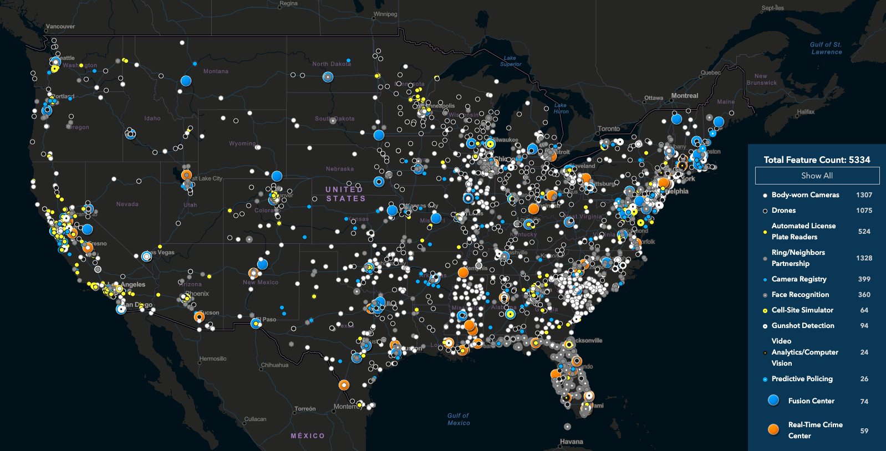

## Digital Threats to Social Movements

> We recommend that you read the Chapters on [What is encryption?](1-1_cryptography.md) and [Metadata](1-9_metadata.md).  After reading this section, be sure to read the Chapter on [Defending against Surveillance and Suppression](3-0_defense_overview.md).

#### What you'll learn

1. What threat modeling is.
1. Who is engaged in surveillance and the strategies they use.
1. Examples of tactics and programs used in surveillance.

---

Social movements challenging powerful individuals, organizations, and
social structures face a broad range of surveillance risks.  Specific
threats vary widely in technical sophistication, likelihood, and
potential for harm.  **Threat modeling** is a process whereby an
organization or individual considers their range of adversaries,
estimates the likelihood of their various data and devices falling
victim to attack, and finally considers the damage done if attacks
were to succeed. (And then they work to protect the data that is most
at risk and that would be the most damaging to lose or have accessed.)

We think about surveillance in the following order to inform how to protect oneself:

1. Who is your **adversary**?  Is it a neighborhood Nazi who is taking
revenge on you for your "Black Lives Matter" lawn sign?  Is it an oil
corporation who is fighting your anti-pipeline activism?  Is it the US
Government trying to prevent you from whistle-blowing?  By
understanding who your adversary is, you can surmise their resources
and access to capabilities.

2. Is your adversary going after you in particular, or are they trying
to discover who you are, or are they collecting a lot of information
in the hopes of getting your information?  Namely, what **surveillance
strategy** are they likely to employ?  This will help you understand
what *type* of and *where* your data may be at risk.

3. What particular **surveillance tactics** will your adversary employ
to get that desired data?  This will help you understand *how* to
protect that data.

We examine surveillance risks starting with the adversary because it
is strategic to do so.  No one can achieve perfect digital security,
but one can be smart about where to spend one's effort in protecting
oneself against surveillance.  In an actual threat-modeling discussion
within an organization or social movement, *who* potential adversaries
are is often more readily apparent than *how* such adversaries would
carry out attacks.  Who the adversary is then informs the range of
techniques available to that adversary (depending on their available
resources and legal authorities), and in turn, what protective
behaviors and technologies the organization can employ.

### Surveillance adversaries

We generally think of adversaries in terms of what resources they have
available to them and for the purposes of this book, limit
ourselves to three adversary categories:

**Nation states** have access to the most resources in a way that may
  make it seem that their surveillance capabilities are limitless.
  Even so, they are unlikely to be able to break strong encryption.
  Here, we think of the National Security Agency as the entity with
  access to the most sophisticated surveillance capabilities.  The disclosures by Edward Snowden in 2013 give the most comprehensive window into nation-state level capabilities, and are searchable in the Snowden Surveillance Archive.

**Large corporations** and **local law enforcement** are often heavily
  resourced and share information with each other but don't
  necessarily have access to the capabilities of nation states.  However, use of technology to aid in surveillance is widespread among law enforcement agencies in the US as illustrated below in this screenshot from Electronic Frontier Foundation's Atlas of Surveillance.

**Individuals** have the least resources, but might know you
  personally, and so be able to more effectively use social
  engineering to obtain your data.

Note that techniques available to lower-resourced adversaries are also
available to higher-resourced adversaries.  As an example,
corporations and law enforcement employ informants and infiltrators,
which may be an individual who knows you personally. Also, while more
sophisticated surveillance capabilities are not usually available to
lower resourced adversaries, it is not always the case: police
departments in large cities may have access to nation-state level
resources (for example, through data sharing that is facilitated by
Fusion Centers), or a particularly skilled neighborhood Nazi may
possess advanced hacking skills that enable some corporate-level attacks.

So while these categories are not sharply defined, they can act as a
starting point for understanding risks, focusing on their *most
likely* strategies and thus your *most likely* weaknesses.

### Surveillance strategies

There are two broad strategies of surveillance: mass surveillance and targeted surveillance.

**Mass surveillance** collects information about whole populations.
  This can be done with the purpose of trying to better understand
  that population.  For example, the collection and analysis of
  health-related data can help identify and monitor emerging
  outbreaks of illnesses.  Mass surveillance may be used as a strategy
  to identify individuals of interest within the surveilled
  population.  For example, video feeds from security cameras can be
  used to identify those who engaged in property damage.  Or mass
  surveillance may garner information about a particular individual.
  For example, information collected from the mass deployment of
  licence plate cameras can be used to track the movements of that
  particular individual.

**Targeted surveillance** *only* collects information about an
  individual or a small group of individuals.  For example,
  wiretapping intercepts the communications of a particular
    individual.  Targeted surveillance allows for the existence of prior
  suspicion and can (conceivably) be controlled: for example, law
  enforcement obtaining a warrant based on probable cause before
  intercepting someone's mail.

Historically, there was a clearer divide between targeted and mass
surveillance.  However, in the digital age, many tactics of targeted
surveillance can be deployed on the mass scale, as we will discuss
further.  In addition to this classic division of surveillance strategies, we
draw attention to a bigger strategy that is unique to the digital age.

**Collect-it-all** may simply be viewed as mass surveillance on
  steroids, but goes far beyond what may have historically been viewed
  as mass surveillance.  Where mass surveillance may
  encompass things like security cameras, monitoring of bank
  transactions, scanning of emails, collect-it-all aims to collect
  *all* information that is digitized, and for any information that
  isn't digitized or collectible (for example, formerly closed-circuit
  security cameras being networked), digitize it and collect it.
  Collect-it-all is infamously attributed to General Keith Alexander,
  former director of the National Security Agency whose mass
  surveillance strategies were born in post-9/11 Iraq and were
  described as follows: "Rather than look for a single needle in the
  haystack, his approach was, 'Let's collect the whole
  haystack. Collect it all, tag it, store it ... And whatever it is
  you want, you go searching for it."  This is likely the inspiration
  for many of the National Security Agency (NSA) programs that were uncovered by Edward Snowden
  that we highlight below.

Different adversaries tend to deploy different surveillance
strategies, or rather, lower-resourced adversaries tend to be limited
in their strategies, as depicted:

### Surveillance tactics

To go over all the surveillance tactics that are available to adversaries at all levels would fill an encyclopedia.  Here we illustrate a few examples of surveillance programs and tactics that support the surveillance strategies above.  We illustrate these programs (below) according to the minimum level of sophistication required to use the tactic and the number of people whose information would be collected via these means.

**Mass interception and collection of data**

We start with what most
people probably think of when they think of mass surveillance: the
interception and possible recording of vast amounts of
communications.  Many mass interception programs were uncovered as
part of Edward Snowden's disclosures in 2013.  **STORMBREW**, **FAIRVIEW**,
and **BLARNEY** are three such programs through which the NSA collects
data in transit by partnering with telecommunications companies and
getting access (for example) to data passing through submarine data
cables.  This allows for the collection of any unencrypted content and
all associated metadata while it is in transit from origin to
destination.  However, these programs cannot see content that is
typically encrypted in transit, such as email or accesses to cloud
storage.  The **PRISM** program (also held by the NSA) is a partnership of
NSA with various internet companies (such as Google, Microsoft and
Facebook as illustrated below) to allow NSA access to data held on
company servers.  That is, if the information was encrypted in transit
and so not collectable via STORMBREW, FAIRVIEW, and BLARNEY, then the
NSA can get it via PRISM -- unless the information is encrypted on the
company servers with a key that the user controls.

#/media/File:Prism_slide_5.jpg")

**Aggregating and analyzing data**

Once you have a whole lot of surveillance data, what do you do with
it?  Surely the Man will not be able to find my tiny little needle in
that massive haystack.  This is where data mining, from basic search
to (creepy) predictive machine learning models come in to make vast
amounts of mass surveillance data (including from disparate sources)
useful to powerful adversaries.

The most basic functionality is search: given a large amount of data,
retrieving the data of interest, such as that related to a particular
person.  **XKEYSCORE** acts as Google search for NSA's mass surveillance data
stores.  While the functionality is basic, the sheer amount of information it has access to (including that from the NSA programs highlighted above, places XKEYSCORE (and any related program) as accessible to only the most powerful adversary.

On the other hand, **Dataminr** searches publicly available data (such as
social media posts) to uncover and provide details of emerging crises
(such as COVID-19 and George Floyd protests) to their customers, which
include newsrooms, police departments, and governments through both
automated (software) and manual (human analysis) means.  Dataminr and
other social media monitoring platforms, of which their are dozens if
not hundreds, have come under fire for their surveillance of
First-Amendment protected speech, most notably of the Movement for
Black Lives.  In several instances, Twitter and Facebook cut off
social media monitoring companies' easy access to their data after public
outcry over misuse.

Going further, **Palantir** is one of many predictive policing platforms that supposedly predict where policing is needed, be that a street intersection, a neighborhood, or an individual.  In reality these platforms do little but reinforce racist norms.  By using data about current police data as the starting point, where communities of color and impoverished neighborhoods are over-policed, predictive models will simply send police to where so-called crimes have been discovered in the past.

Going further still, **EMBERS** ("Early Model Based Event Recognition using Surrogates"
has been used since 2012 to predict "civil unrest events such as protests, strikes, and 'occupy' events" in "multiple regions of the world" by "detect[ing] ongoing organizational activity and generat[ing] warnings accordingly." The warnings are entirely automatic and can predict "the when of the protest as well as where of the protest (down to a city level granularity)" with 9.76 days of lead time on average. It relies entirely on publicly available data, such as social media posts, news stories, food prices, and currency exchange rates.

**Targeted collection of data**

Another surveillance tactic that likely comes to mind is that of the wiretap.
However, the modern equivalent is a lot easier to enable than the
physical wire installed on a communication cable from which wiretap
gets its name.  One modern version is the Cell Site Simulator
(**CSS**) which is a miniature cell tower (small enough to be mounted
on a van) that to cell phones in the vicinity still provides the best signal strength, and so nearby cell phones connect to it.  At a most basic level a CSS will
uncover the identities of the phones in the area.  (Imagine its use at
the location of a protest.)  Different CSSes have different
capabilities, from simply passing on the communications to and from
the broader cell network, but gaining access to meta-data.  In some
cases, CSSes are able to downgrade service from (for example) 3G to
GSM, removing in-transit encryption of cell communications with the
cell service provider and giving access to message content.  In other
cases, CSSes can block cell communications by having phones connect to
it, but not passing information onto the greater cell phone network.
CSSes are fairly commonly held by law enforcement agencies (as
illustrated in the map at the top of this page).

Surveillance equipment, including CSSes and high-resolution video, can
also be mounted to surveillance **drones** or **UAVs** (unmanned
aerial vehicles), which can greatly increase the scope of surveillance
from a few city blocks to a whole city.  This is one example where
tactics of targeted surveillance being expanded toward a mass level.
Persistent Surveillance Systems has pitched the use of UAVs to many US
police departments.  Persistent Surveillance's UAV uses ultra-high
resolution cameras that cover over 32-mile square miles in order to be
able to track the movements of individual cars and people, including
historically.

Of course, often it isn't necessary to surreptitiously collect
information.  Sometimes you can just ask politely for it.  In the US,
subpoenas and warrants are used to request for information from
corporate providers.  While warrants require probable cause (in the
legal sense), subpoenas do not.  As Google publishes in its transparency report, Google receives around 40,000 data requests every year, about a third of which are by subpoena.  Google returns data
for roughly 80% of requests and each request impacts, on average,
roughly 2 user accounts (i.e. each individual request is highly targeted).  Of
note is that the content of emails are available by subpoena.  While
subpoenas and warrants are basic in their nature, they usually can
only be accessed by governmental adversaries.

**Attacking devices**

The tactics above attempt to collect data while it is in transit or
when it is held in the cloud.  A final place to collect your data is right from your own device (phone or computer).  This might happen if your device is confiscated by the police during a detention or at the border during a search.  We will discuss this more in the Chapter on [Protecting your Devices](3-1_devices.md), but highlight some tactics for extracting device-held data here:

Cellebrite is an Israeli company that specializes in selling tools for
extracting data from phones and other devices, such as their Universal
Forensic Extraction Device (**UFED**) which is small enough to carry
in a briefcase and can extract data quickly from almost any phone.
However, this requires physical control of your device.  NSO Group
(another Israeli company) sells the ability to remotely install
spyware called **Pegasus** on some iPhones and Androids that will
extract text messages, call meta-data, passwords, among other data.
The NSA has a family of malware (malicious software) denoted **QUANTUM** which can either
gather data or block data from reaching the target device.  But the NSA is able to install this malicious software on a mass scale with the use of their **TURBINE** system which is able to disguise NSA servers as, for example, Facebook servers and use this as a means to injecting malware onto the target's device.

While Pegasus and QUANTUM can be deployed widely, it can be politically dangerous to do so, as these programs are generally met with public outcry.  The more widely an invasive surveillance technology is deployed, the more likely it is to be discovered, as was the case with Pegasus.

**Personalized harassment**

While outside the realm of typical surveillance, personalized
harassment should be in mind when considering digital security risks.
Doxxing, phishing and password sniffing are techniques available to
the least-resourced adversary, but shouldn't be ignored for that
reason.  You may wish to revisit the story of Black Lives Matter
activist DeRay McKesson from the Chapter on [Passwords](1-6_passwords.md) having his Twitter account
compromised despite employing 2-factor authentication.  All his
adversary needed was access to some personal information, which may
have been discoverable from public sources or through personal
knowledge.

**Doxxing** is the process of publishing (on a discussion site, for
  example) a target's personal information that might lead to the harm
  or embarrassment of the targeted individual.  While this is very
  easy to do, it is also very difficult to protect yourself: once
  information about you is available online, it is challenging or
  impossible to remove it.

**Phishing** describes methods of obtaining personal information, such
  as a password, through spoofed emails and websites.  While phishing
  can be deployed on a mass scale, the most successful type of
  phishing (spear phishing) targets individuals by using already-known
  information to improve success rates.

**Password sniffing** can be as low tech as looking over your shoulder to see you type in a password or can involve installing a keystroke logger to record you typing in your password, but this requires the ability to install a keystroke logger on your device, for which there are methods of varying degrees of sophistication.  Traditional password sniffing captures a password as it passes through the network, which can be possible if the traffic is not encrypted, and again requires varying degrees of sophistication, but certainly could be deployed by a skilled individual.

### In context: Standing Rock

In 2016, opponents to construction of the Dakota Access Pipeline
(DAPL) set up a protest encampment at the confluence of the Missouri
and Cannonball rivers, under which the proposed oil pipeline was set
to be built.  The pipeline threatened the quality of the drinking
water in the area, which included many Native American communities,
including the Standing Rock Indian Reservation.  Eventually the
protest encampment would grow to 1000s of people and was in place for
10 months.

Energy Transfer Partners, the company building DAPL, employs a private
security force, which, a few months into the protest encampment,
unleashed attack dogs on the protesters.  In addition, Energy Transfer
Partners very quickly hired TigerSwan to aid in their suppression of
the protest movement.  TigerSwan is a private mercenary company which
got its start in Afghanistan as a US government contractor during the
war on terror.  As such, TigerSwan employs military-style
counterterrorism tactics and refers to the Native American and
supporting protesters as an insurgency, comparing them (explicitly) to
the jihadist fighters against which TigerSwan got its start.
TigerSwan's surveillance included social media monitoring, aerial
video, radio eavesdropping and the use of infiltrators and informants.

Eventually local, regional and federal law enforcement would be called
in, with TigerSwan providing situation reports to law enforcement and
in regular communication with the FBI, the Department of Homeland
Security, the US Justice Department, the Marshals Service, and the
Bureau of Indian Affairs, as well as state and local police.  While
many (but not all) of the tactics employed by TigerSwan would be
illegal for government law enforcement to adopt, the State is able to
skirt this by receiving updates from private companies.  This is
common practice in many arenas in law enforcement with police
departments buying privately held data that would violate the 4th
amendment if the data was collected directly by the State.

The public-private partnership between State law enforcement agencies,
Energy Transfer Partners and TigerSwan was instrumental in bringing an
end to the protest encampment, with the State eventually violently
removing protesters through the use of tear gas, concussion grenades
and water cannons (in below-freezing weather), resulting in
approximately 300 injured protestors (including one woman who nearly
lost an arm).

While the encampment ended, and the pipeline eventually was built, continued opposition eventually led to a court ruling that the pipeline must be shut down and emptied of oil in order to complete a new environmental impact review.

It is important to remember that even though mass surveillance collects information about almost everyone, harm from mass surveillance is differential.  Certain groups are surveilled more heavily, or surveillance information about certain groups is used disproportionately.  Examples of groups in the US that are disproportionately harmed by State and corporate surveillance are Muslim Americans, Black and African Americans, Native Americans and social movement participants as we discussed in the Chapter on [Mechanisms of Social Movement Suppression](2-01_suppression.md)

#### What to learn next

We encourage you, after this rather dismal account of all the ways your data can be swept up, to immediately start reading about [Defending against Surveillance and Suppression](3-0_defense_overview.md).

#### External resources

* [Snowden Surveillance Archive](https://snowdenarchive.cjfe.org) from Canadian Journalists for Free Expression.
* [Atlas of Surveillance](https://atlasofsurveillance.org/) from Electronic Frontier Foundation.
* [Department of Homeland Security: Fusion Centers](https://www.dhs.gov/fusion-centers)
* [Google's Transparency
Report](https://transparencyreport.google.com/)
* ["For NSA chief, terrorist threat drives passion to 'collect it all,' observers say."](https://www.washingtonpost.com/world/national-security/for-nsa-chief-terrorist-threat-drives-passion-to-collect-it-all/2013/07/14/3d26ef80-ea49-11e2-a301-ea5a8116d211_story.html) The Washington Post,  July 2014.
* [No Place to Hide.](https://www.worldcat.org/title/no-place-to-hide-edward-snowden-the-nsa-and-the-us-surveillance-state/oclc/864356553)  Glenn Greenwald, 2014.
* ["Gotta Catch 'Em All: Understanding How IMSI-Catchers Exploit Cell Networks."](https://www.eff.org/wp/gotta-catch-em-all-understanding-how-imsi-catchers-exploit-cell-networks) Electronic Frontier Foundation, June 2019.
* ["ACLU Lawsuit Over Baltimore Spy Planes Sets Up Historic Surveillance Battle."](https://www.aclu.org/news/privacy-technology/aclu-lawsuit-over-baltimore-spy-planes-sets-up-historic-surveillance-battle/) ACLU, April 2020.
* ["Police Surveilled George Floyd Protests With Help From Twitter-Affiliated Startup Dataminr."](https://theintercept.com/2020/07/09/twitter-dataminr-police-spy-surveillance-black-lives-matter-protests/) The Intercept, July 2020.
* ["Aided by Palantir, the LAPD Uses Predictive Policing to Monitor Specific People and Neighborhoods."](https://theintercept.com/2018/05/11/predictive-policing-surveillance-los-angeles/) The Intercept, May 2018.
* ["EMBERS at 4 years: Experiences operating an Open Source Indicators Forecasting System."](http://dl.acm.org/citation.cfm?doid=2939672.2939709) Presented at the International Conference on Knowledge Discovery and Data Mining, 2016.
* ["An Israeli tech firm is selling spy software to dictators, betraying the country’s ideals."](https://www.washingtonpost.com/opinions/2018/12/05/israel-is-selling-spy-software-dictators-betraying-its-own-ideals/) The Washington Post. December 2018.
* ["Oil and Water."](https://theintercept.com/series/oil-and-water/) The Intercept. 2016-2017.
* ["Dakota Access Pipeline to Shut Down Pending Review, Federal Judge Rules."](https://www.nytimes.com/2020/07/06/us/dakota-access-pipeline.html) New York Times. July 2020.
