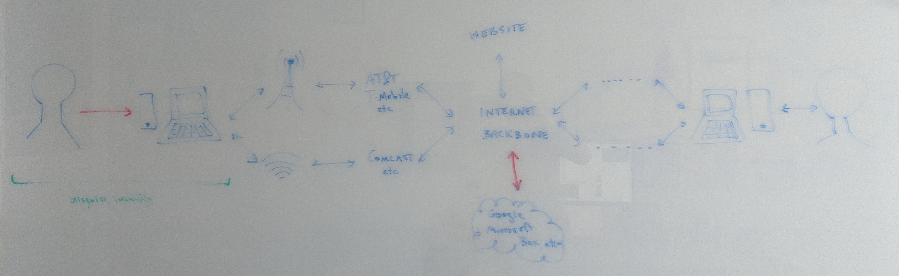

## Defending against Surveillance and Suppression

> We recommend that you read the Chapters on [Mechanisms of Social Movement Suppression](2-01_suppression.md) and [Digital Threats to Social Movements](2-02_digital-threats.md) before reading this Chapter.

#### What you'll learn

1. What threat modelling is.
1. Strategies for reducing threats to your digital security.

---

You may hear that there is no such thing as perfect digital security, and we agree.  The surveillance capabilities of a well-resourced adversary are nearly limitless, and those that we described in [Understanding surveillance threats](2-02_digital-threats.md) barely scratch the surface.  However, not all risks are equal and not all surveillance tools are equally likely to be used, and there is a lot that an individual and a group can do to reduce the threats due to surveillance.
	
We can model a digital security threat in terms of the following relationship:
	
> threat &#x221D; (surveillance capabilities) x (suppression risk) / (effort required to obtain data)

In this model **surveillance capabilities** refers to the level of resources of your opponent as discussed in the Chapter on [Digital Threats to Social Movements](2-02_digital-threats.md).  **Suppression risk** refers to the ways in which your opponent may try to undermine you as discussed in the Chapter on [Mechanisms of Social Movement Suppression](2-01_suppression.md).

It is important to keep in mind that surveillance supports suppression, and in indirect means when not directly so.  Many of the examples we gave in the Chapter on [Mechanisms of Social Movement Suppression](2-01_suppression.md) were indeed supported by surveillance:
* The **direct violence** meted out on Black Panther Party leader Fred Hampton through a targeted assassination was supported by detailed knowledge of his schedule and apartment layout.
* Threats of sanction through **the legal system** against those organizing protests of the inauguration of Donald Trump were supported by a Department of Justice request for all website traffic inforamtion to an organizing webpage (described at the end of the Chapter on [Anonymous Routing](1-a10_anonymous-routing.md)).
* Steven Salaita's **employment deprivation** was a result of the monitoring of his Twitter activity.
* The **deception** used by the FBI against Mohamed Mohamud began with the monitoring of Mohamud's email.

### Reducing the threat
	
When we consider how to reduce digital security threats, we can do so by *reducing* surveillance capabilities or suppression risk or by *increasing* the effort required to obtain your data.

#### Reducing surveillance capabilities
	
Most activists have little immediate control over surveillance capabilities.  However, there are a number of laudable efforts to regulate surveillance with some success, such as the banning of face recognition and CSS in certain jurisdictions.  But unless your social movement organizing is in trying to ban or limit surveillance, going down this route would take you away from your organizing work.

#### Reducing suppression risk

Likewise, activists have little control over suppression risk.  You could minimize the risk of suppression by reducing the threat to your opponent, but then you would be succumbing to the chilling effect.

#### Increasing the effort required to obtain your data

That leaves us with increasing the effort required to obtain your data, which is the focus of the remainder of this book.  While protecting all data is important (the more your opponent knows about you, the better they can undermine you), we encourage putting any additional effort in protecting your data toward the most strategic protective strategies.  So, to *guide* that effort, one should keep in mind the surveillance capabilities of your opponents and their likely modes of suppressing your efforts.  To this end, focus on protecting data that:
1. could most likely be used to suppress your efforts, and
2. is most vulnerable to surveillance.
Understanding point 1 will be through a deep understanding of the efforts and opponents of a given social movement.  To consider point 2, we need to understand where your data is (described below) and how to protect data depending on where it is (the remaining chapters of this book).

### Where is your data?

We take different protective strategies depending on where data is vulnerable.  From you, your information becomes data when it is put on a device (for example, a cell phone or laptop) and then may be transmitted through the internet via service providers.  We distinguish here between websites where you may be browsing or cloud providers where your data may be held (from Google to Facebook).

In the remaining chapters we discuss how to protect where your data is.  In  the Chapter on [Security Culture](3-1_security_culture.md) we discuss how to decide whether your information becomes data (when you have control over it) and whether to store your data in the cloud -- that is whether you want your data to transmit over the red arrows.  In the Chapter on [Protecting your Devices](3-2_devices.md) we discuss how to protect data that is held on devices that you have control over (your laptop and cell phone, for example).  In the Chapter on [Protecting your Communications](3-3_comms.md), we discuss how to protect your data while it transmits from you to your destination, be that a website, cloud provider or another person.  In the Chapter on [Protecting your Remote Data](3-4_cloud.md), we discuss how to protect data that is held in the cloud if you have made the decision to do so.

We then discuss how to protect your identity - that is, how to be
anonymous or pseudonymous online and break through censorship - in the Chapter on 
[Protecting your Identity](3-5_apac.md).  Finally, we discuss how to select digital security tools in the [Conclusion](3-6_trust.md) and give the principles we use for our recommendations.

### In context: Edward Snowden

In the years leading up to 2013, Edward Snowden collected data from his workplaces (mostly NSA subcontractors) that he had access to in his role as a systems administrator.  Snowden's leaks of troves of classified material that illustrated to the world just how advanced and broadly deployed the surveillance tactics of many of the world's most powerful governments were.  However, in order to make these disclosures, Snowden was up against a powerful adversary: the National Security Agency itself.

Snowden was unlikely to achieve long-term anonymity - his goal was to keep his behaviors (collecting information) and goal (whistleblowing) unknown for long enough to leak the information to journalists who would responsibly report on it, and hopefully long enough to get to a safe-haven where he could live in freedom.  It took months for Snowden to set up a encrypted communications channel with Glenn Greenwald (a journalist known for fearless, deep reporting), this being in the days before "plug and play" end-to-end encrypted messaging apps.  But once the reporting on Snowden's disclosures started, he knew his identity would be discovered, and unmasked himself. Snowden didn't end up where he had hoped (Latin America).  His US passport was cancelled during his flight from Hong Kong (where he disclosed his leads to Glenn Greenwald) to Russia, preventing him from further flights.  Snowden was able to claim asylum in Russia.

However, Snowden was very successful in his whistleblowing, with the reporting lasting for years after and with numerous changes to our communications: encryption is more commonly available now, so much so that many people don't even know when their conversations are end-to-end encrypted.

#### What to learn next

* [Security Culture](3-1_security_culture.md)
	
#### External resources

* [Permanent Record.  Edward Snowden, 2019.](https://www.worldcat.org/title/permanent-record/oclc/1111645933)
* [AnarchoTechNYC's persona-based training matrix](https://github.com/AnarchoTechNYC/meta/wiki/Persona-based-training-matrix)
* [EFF's Surveillance Self-Defence: Your Security Plan](https://ssd.eff.org/en/module/your-security-plan)

