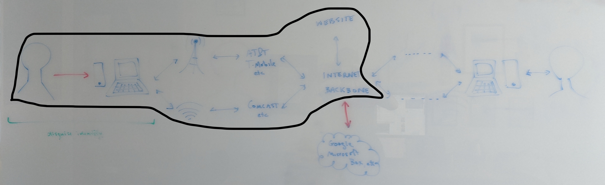
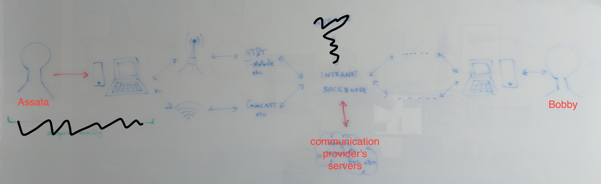
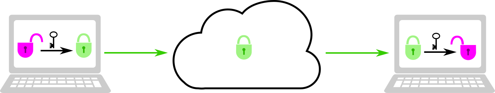

## Protecting your Communications

> We recommend that you read the Chapters on [The Man in the Middle](1-5_man-in-the-middle.md), [Passwords](1-6_passwords.md), and [Digital Threats to Social Movements](2-02_digital-threats.md) before reading this chapter.
	
#### What you'll learn

1. The difference between in-transit and end-to-end encryption.
1. Who has access to your information when not using encryption.
1. Who has access to your information when using in-transit encryption.
1. Who has access to your information when using end-to-end encryption.

---

The best way to protect your online communications is through encryption.  But not all encryption is equally protective.  We will focus on the concepts that distinguish between degrees of protection.

### Encrypted or not

The most basic version of encrypted communications is in-transit encryption, where your information is encrypted between your computer and a server.  In the context of browsing the web, this is the best you can do to protect the content (but not the metadata) of your communications from an adversary.  Most web-browsers indicate whether your browsing is encrypted by the url as illustrated below.
	

	

In the top example, the information is transmitted unencrypted.  The full url in this case is `http://whenisgood.net` where `http` indicates accessing a webpage without encryption.  This browser (Firefox) emphasizes this point with a struck-through lock.  In the bottom example, the information is encrypted: `https` indicates accessing a webpage with encryption and the `s` stands for secure.  The keys used for this encryption are exchanged between your computer and the when2meet servers using Diffie-Hellman key exchange as described in the Chapter on [Exchanging Keys for Encryption](1-3_key-exchange.md).

Using `http`, every entity on the path between you and the website pictured below can access the content of your web browsing (such as the pictures being loaded, and any information you might type into a web form).  Further, anyone snooping the communications between the entities on these paths (such as between Comcast's network and the internet backbone) *may* also have access to your browsing content.  We qualify this with *may* because the communications between two entities on this path may be encrypted.  For example, the communications between a cell phone and a cell tower are encrypted in most cases.

By contrast, using `https`, *only* you and the website (technically, the servers that are hosting the website) have access to the *content* of your browsing.  We specify content here, because certain meta-data would still be known by entities on the path between you and the website, such as the basic url of the website, the amount of time you spend browsing the website, and the amount of information you are downloading from the website.
	
### In-transit encryption

When we communicate with another person by, for example, email, instant messaging, or video chat, those communications are (most often) routed through the communication provider (for example, Google servers for email or Microsoft servers for Skype calls), as pictured below. Nowadays, those communications are usually encrypted, but most often only encrypted between you and the communication provider.  That is, while the entities and eavesdroppers along the path between Assata and the communication provider's servers (center) and between the communication provider's servers and Bobby do not have access to the content of your communications (but can glean metadata), the communication provider *does* have access to the content of your communications.

	
We call this in-transit encryption because the content is encrypted while it is in transit between Assata and the communication provider and between the communication provider and Bobby.  The encryption keys used for such in-transit encryption are generated separately for each part of the path between Assata and Bobby, pictured below.  The provider (center) performs a Diffie-Hellman key exchange with Assata, generating a shared key and performs a separate Diffie-Hellman key exchange with Bobby, generating a *different* shared key.  When Assata sends a message to Bobby through the provider, the message is first encrypted with the key Assata shares with the provider and then the message is transmitted to the provider.  The provider decrypts the message with the key that Assata and the provider shares.  Then the provider re-encrypts the message with the key that the provider shares with Bobby before transmitting the encrypted message to Bobby.  Bobby can then decrypt the message.  Therefore, the message only exists in a decrypted state on Assata and Bobby's devices and the provider's servers; the message is encrypted when it is in transit between these entities.
	

	
### End-to-end encryption

While in-transit encryption protects your communications from many potential adversaries (such as your internet service provider, the wifi hotspot, or snoop along the communication channels) the communication provider still has access to all that information.  Even if the provider is not a direct adversary, they may share that information with an adversary (such as through a subpoena or warrant).  End-to-end encryption (E2EE) will protect your communications from even the communication provider.

For E2EE (pictured below), Assata and Bobby exchange keys (using Diffie-Hellman key exchange or similar).  While their communications are routed *through* the communication provider, so long as the provider isn't mounting a man-in-the-middle attack, the communications through the provider are encrypted with a key that only Bobby and Assata have access to.  That is, the message only exists in a decrypted state on Assata and Bobby's devices.  Assata and Bobby's devices are the *end*points of the communication (hence end-to-end encryption).

### Authentication

While E2EE is the gold standard, there are further considerations.

As mentioned above, end-to-end encryption is only established if the communication provider (or another third party) does not mount a man-in-the-middle attack starting at the time of key exchange.  However, as we covered in the Chapter on [The Man in the Middle](1-5_man-in-the-middle.md), if Assata and Bobby verify their keys through an independent channels, they can determine whether or not a man-in-the-middle attack has occurred and so whether their communications are truly end-to-end encrypted.

While many apps or services claiming E2EE provide the ability to verify keys, many do not, providing little guarantee to trust the claims of E2EE.  Further, for those E2EE apps that do provide the ability to verify keys, most operate on a Trust On First Use (TOFU) basis.  That is, communications may begin without verifying keys first.  However, while actually doing key verification is the only way to guarantee E2EE, the existence of the *ability* to verify keys is protective against automated man-in-the-middle attacks, as even a small fraction of users verifying keys would catch widespread man-in-the-middle attacks.

And of course E2EE only protects the communication between devices - it does not protect the data that is on the device.  E2EE apps should be combined with strong passwords to protect the account or device.
	
### In context: Multi-party video chatting 

There are many apps and services for video chatting between two or more people, with varying degrees of security.  Here are three illustrative examples:

* Wire provides the gold-standard of E2EE.  Each user has an account that can be accessed from multiple devices (for example, laptop and smartphone).  There is a public key for each device that is used to establish an encryption key for a session (for example, a video call) and the fingerprints of these keys can be compared to verify true E2EE.  Wire allows E2EE video calls for groups of up to 12 users.

* Zoom allow video calls for much larger groups and does provide E2EE in that a video stream is encrypted and decrypted by the users with the same key.  However, this key is established and distributed by the Zoom servers.  Since Zoom has access to the encryption key, this cannot be considered true E2EE.  Further, there is no mechanism for users to verify the encryption keys.  As of Summer 2020, Zoom had a proposal for establishing keys for true E2EE, but not yet implemented.

* Jitsi Meet also provides large group video conferencing, but only using in-transit encryption.  However, Jitsi Meet is available to be hosted on any server (including your own, if you are so inclined).  There is an instance of Jitsi Meet hosted by May First, a non-profit provides technical solutions to social movements and is a trusted third party to many groups.  Even though May First has access to these communications, some would prefer to trust May First over a profit-driven solution such as Zoom.
				
#### What to learn next

* [Protecting your devices](3-2_devices.md)
* [Protecting your remote data](3-4_cloud.md)
* [Protecting your identity](3-5_apac.md)

#### External resources

1. [E2E Encryption for Zoom Meetings](https://github.com/zoom/zoom-e2e-whitepaper)
	

