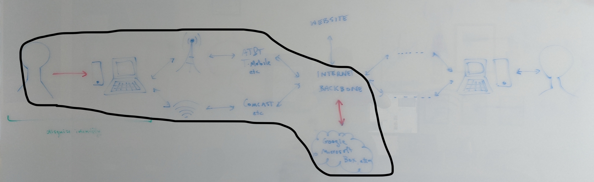

## Protecting your Remote data

> We recommend that you read the Chapter on [Protecting your Communications](3-3_comms.md) before reading this chapter.
	
#### What you'll learn

1. Who has access to your data in the cloud.
1. What of your data is in the cloud.

---

The cloud it uniquitous.  Since the early 2000s, data is increasingly not stored exclusively (or at all) on your own device, but on the servers of the companies that manage your device or operating system or whose services you subscribe to.  If that data is not encrypted with a key that you control, that data is at risk for compromise.

Accessing your remote or *cloud* data or storage is similar to accessing a webpage, as pictured below.  In most models of accessing cloud storage, the information is protected by in transit encryption which would protect your data from potential adversaries along the path through the internet from your device to your cloud storage provider's servers (pictured below).

However, as discussed in the Chapter on [Digital Threats to Social Movements](2-02_digital-threats.md), data that is stored remotely (and is not encrypted) is accessible by government adversaries by subpoena or warrant or may simply be shared with third parties.  Unfortunately, even if we avoid the most explicit forms of remote data (such as offered by DropBox or Google Drive), many of our devices encourage remote back up of all our data (such as Apple devices to the iCloud), in some cases making it very difficult to avoid (as for Android devices to a Google account).  This includes a potential wealth of information, including your addresses, calendar, location history, browsing information --- potentially anything you do with your computer.
	
### In context: Trusted or encrypted cloud storage

There are many choices for cloud storage.  We describe a few options that illustrate the breadth of options from not-encrypted-and-not-trusted through not-encrypted-but-trusted to encrypted.

* Google will happily store all your information (email, files, contact information, device back ups) for free.  Of course, they extract value from this by using your data, and they can't do so if that data is encrypted with a key that only you control (and so it isn't).  As we saw in the Chapter on [Digital Threats to Social Movements](2-02_digital-threats.md), Google returns data in response to roughly 80\% of subpoena requests.

* Owncloud provides Box or DropBox style cloud storage, but, like Google's products, only using in-transit encryption.  (An enterprise version of Owncloud does provide some end-to-end encrypted file storage and sharing.) However, Owncloud, like the video-conferencing app Jitsi Meet, is available to be hosted on any server (including your own). Also, like Jitsi Meet, there is an instance of Owncloud hosted by May First, a service provider that is trusted by many.  Even though May First has access to your stored data, some would prefer to trust May First over Google.

* Cryptpad is a collaborative editing platform that offers an end-to-end encrypted alternative to Google Docs.  Documents are accessed by a link that includes the key for decrypting the document, but that key appears after a # in url, for example:
`https://cryptpad.fr/pad/#/2/pad/edit/bpsky2zF5La8sZ_i-6r_cTj9fPL+/`
The part of the url after a # is known as a fragment identifier and is not transmitted to the server, but is only used within the browser, in this case to decrypt a given pad.  Since the encryption key is part of the url, one must take care in sharing such a link.  (That is, only share this link over an encrypted channel, such as Signal.)

* Keybase has a number of features including an end-to-end encrypted storage system akin to Owncloud or DropBox.  Unlike Cryptpad, Keybase offers standalone apps (rather than operating in a browser) and handles the management of keys.

#### What to learn next

* Any remaining chapter in [Part III](index.md).
