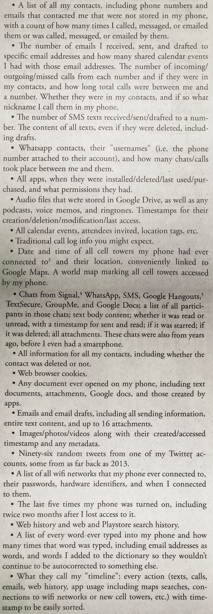

## The data you keep with you: protect your devices

> We recommend that you read about [modern cryptography](modern-cryptography.md) and about what makes a good password [[link to section on properties of good passwords]] before reading this section.

#### What you'll learn

1. TODO

---

The amount of data you keep on your phone and laptop is staggering.  Contacts, emails, photos, documents, calendars, tax returns, banking details, and, in the case of a smartphone, often a detailed history of your location as long as you've had that phone.
A lot of this data you will also share with your cloud storage providers (i.e. Apple, Google, DropBox), but that is the focus of [another chapter](comms.md). Here we focus on protecting the data that you keep with you, on your laptops and cell phones, from a remote or physical attack.

### Physical attacks

By a physical attack, we mean that your adversary would first gain physical access to your device through loss, theft, or confiscation.  You may lose your phone at an inopportune moment that places it in the hands of an adversary rather than a good Samaritan, or your adversary may steal your phone.  More likely your phone may be confiscated while crossing a border or during an arrest, either planned or unplanned.

Those who were swept up in the mass arrests during the protests of the presidential inauguration on January 20, 2017 (J20) had their phones confiscated and subject to search by a tool from the Israeli company Cellebrite which extracts all information on a device (phone or computer) and all remote accounts that device has access to (e.g. Google, Facebook, Dropbox).  One J20 defendant described the 8000 pages of data that a Cellebrite tool extracted from his confiscated cell phone; he received this information from his lawyer as they prepared for his defense:

*From "How to Protect Yourself from the Snitch in Your Pocket", Earth First! The Journal of Ecological Resistance. Winter 2017-18.*

#### What can I do?

A detective testifying at a J20 trial noted that among the phones that had encryption enabled, he was only able to access basic device information and not the contents of the phone storage. (iPhones have encryption enabled by default, while many Android devices do not.)  Indeed, this is the the first thing you can do encrypt your phone and computers.  It is not, however, a panacea.  The encryption that protects your device is only as strong as the password protecting it.

Device encryption passwords regrettably suffer from a convenience-security tradeoff.  A [passphrase]([[link to password section]]) may need to be composed of 6 or more words to sustain a physical attack, but such a passphrase is cumbersome to type in frequently.  There are a few options, all with trade-offs.  For phones or laptops, you can modify your settings to change how often you need to enter your password, passphase or unlock code (encryption is only in effect when a screen lock is enabled). Or you could modify the strength (length) of your password, passphase or unlock code depending on your situation.  However, these strategies rely on knowing when your situation requires higher levels of security and consistently strengthening your security when needed.

For phone and some laptops, one can often choose between a typed passphrase or biometric input (such as a fingerprint).  A fingerprint is more convenient than a typed password.  For the purposes of encryption, your fingerprint will be paired with a passphrase (which should be as strong as you can manage).  However, if your device is confiscated by law enforcement, your fingerprint may be compelled from you.  So in certain situations, one should still consider removing the ability to biometrically unlock your device.

There are other options one might consider.  A privacy screen can provide protection from an eavesdropper to you typing in passwords (and anything else).  Faraday bags can prevent your phone from transmitting or receiving information; among other things, this can prevent your phone from recording location information.  The ability to remotely wipe your phone is provided by major cell phone manufacturers, and while it may relinquish control over your device to the same corporations that may share your information with your adversaries (as we discuss in [another chapter](comms.md)), it may be a useful tool in certain situations.

### Remote attacks

By a remote attack, we mean that an adversary would access the data on your phone or laptop through an internet or data connection.  There are companies that design and sell the ability to infect your device (usually focusing on smartphones) with malware that would allow their customer (your adversary, be it a corporate or state agent) to gain remote access to some or all of your information.

For example, Citizen Lab uncovered wide and varied use of the spyware Pegasus created and sold by another Israeli company, NSO Group.  Coupled with some social engineering to convince the target to click on a link, the spyware grants the ability to turn on and record from the phone's camera and microphone, record calls and text messages (even those providing end-to-end encryption), log GPS locations and send all this information back to the target's adversary. Citizen Lab reported that Pegasus attempts were made against Ahmed Mansoor, a human rights defender based in the UAE and 22 individuals in Mexico ranging from politicians campaigning against government corruption to scientists advocating for a state tax on sugary drinks.

#### What can I do?

Remote attacks, such as sold by NSO Group, rely on flaws in computer software known as zero-days. Such flaws are unknown to the software provider (e.g. Apple, Microsoft, or Google). Until they are known to the software provider (which happens on "day zero"), there is no chance that the software provider could have fixed or patched the vulnerability and so there is no chance that a victim could protect themself.  Computer security is often a cat-and-mouse game.  The products of malware and spyware creators (such as NSO Group) are only good so long as the targets (or more accurately, companies like Apple, Google and Microsoft) don't know about the malware being deployed.  As soon as they do, they fix their products so that the malware is no longer effective.

But these product fixes only work if the target (you) update your device.  So the lesson here is to **install all security updates as soon as they are available**.  Unfortunately, smartphones [[add info here about smartphone security support]].

Many malware products require phishing for installation on the target's device: convincing the target to click on a link or opening a file (either in an email or a text message).  So, the second thing you can do is be wary of what you click on.  Do you know the sender?  Are you expecting something from the sender?  Does anything seem, well, fishy?  In fact, it was vigilance that led Ahmed Mansoor to avoid spyware infection: he sent the phishing text along to Citizen Lab that led to their reporting on the abuse of spyware from NSO Group.

Finally, be wary of the apps you install and what permissions you grant them.  Does a flashlight app need access to your contacts and camera?  Do you really need to install that game created by an unknown software creator?  Every app you install is a potential vector for malware, so it is a good opportunity to practice minimalism.

### What you can't do

* build your own computer/phone
* trust devices 100%, supply chain manipulation

* What devices look like
** Is this useful?  maybe incorporate into what you can't do - to talk about closed source nature of cell phones in particular
** tactical tech cell phone layers
** compare to laptops/computers

#### External Resources

1. [Citizen Lab reporting on abuse of NSO Group's Spyware](https://citizenlab.ca/2016/08/million-dollar-dissident-iphone-zero-day-nso-group-uae/)
1. [Criminalizing Dissent: Contested Evidence Introduced in J20 Trial Testimony](https://www.unicornriot.ninja/2017/criminalizing-dissent-contested-evidence-introduced-j20-trial-testimony/), Unicorn Riot. November 29, 2017.
1. [Phone Crackers](https://motherboard.vice.com/en_us/topic/phone-crackers), Motherboard. December 21, 2016 to present.

#### Cell Phones

* Level-UP.cc narrative of mobile device network and components:
    ** https://level-up.cc/curriculum/mobile-safety/how-mobile-networks-work/input/how-do-mobile-devices-work/
* Tactical Tech (me and my shadow) - mobile device layers diagram:
    ** https://myshadow.org/ckeditor_assets/attachments/94/mobile_breakdowna5.pdf
* Security in a box--some things horribly out of date but good to account for things here:
    ** https://securityinabox.org/en/guide/mobile-phones/
    ** https://securityinabox.org/en/guide/smartphones/

#### Data Protection

* Level-UP.cc training modules on PASSWORDS and BACKUPS:
** http://level-up.cc/curriculum/protecting-data/

#### Malware Protection
