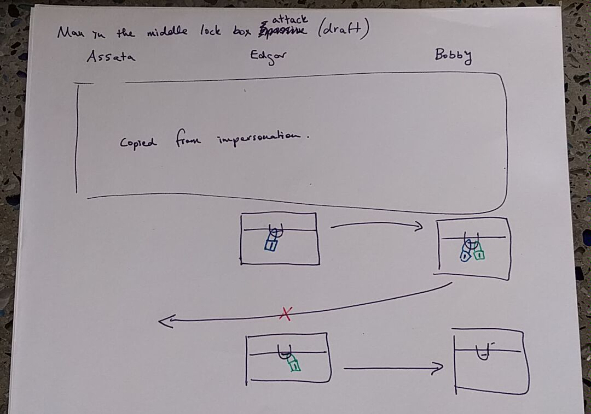
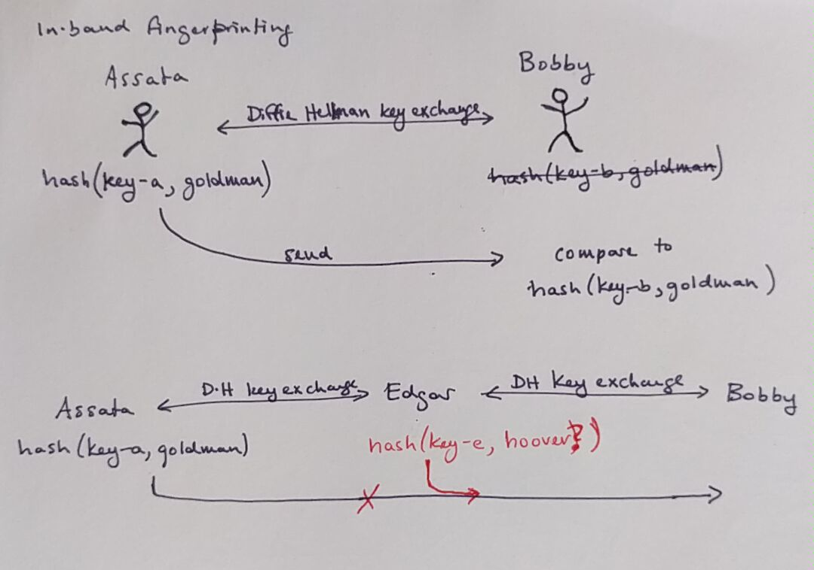

## How the man in the middle can foil your crypto, and what you can do about it.

> We recommend that you read [Key exchange: How to agree on a cryptographic key over the Internet](key-exchange.md) and [Cryptographic hashes](cryptographic-hash.md) before reading this section.

#### What you'll learn

1. What an impersonation attack is.
1. What a man-in-the-middle attack is.
1. The difference between a passive and active man-in-the-middle attack.
1. How to uncover man-in-the-middle attacks occuring during key-exchange using fingerprinting.

---

In [Key exchange](key-exchange.md) you learned how two people can agree on a cryptographic key, even if they have not met.  While this is a robust method, it suffers from the limitation that, on the Internet, it is difficult to be sure that you are communicating with the person or entity you are trying to communicate with, be that a friend you are instant messaging or emailing, or the server that you are trying to load a webpage from.  We will first show how an eavesdropper can intercept your communications with our lock-box example from [Key exchange](key-exchange.md), and then show how this plays out in a Diffie-Hellman key exchange.  These interceptions of communications are called attacks.

### A physical man-in-the-middle attack

Recall that Assata was able to send Bobby a secure package by sending a lock box back and forth three times: once with her lock on it, returned with Bobby's lock on it as well, and finally with her lock removed, and only Bobby's lock on it.  However, how does she know it is actually Bobby who receives the package?  And how does she know that it is Bobby's lock on the box when it is sent back to her?

Suppose Edgar intercepts the lock box from Assata to Bobby with Assata's lock on it. Edgar could send the lock box back to Assata with his own lock on it.  Unless Assata is able to tell the difference between a lock from Edgar and a lock from Bobby, Assata would assume that the lock is Bobby's lock, remove her lock and send the package on to Bobby.  If Edgar intercepts the package again, he can now open the box and examine the contents of the package since it only has his lock on it.  For Edgar to do this, he must intercept all the packages being sent from Assata to Bobby.  This attack on Assata's communication with Bobby is called an *impersonation attack*: Edgar is impersonating Bobby.  (This is not generally considered a man-in-the-middle attack.)

In the situation as described, Bobby never received a package at all.  Edgar could go further though.  Edgar could, after opening the lock box from Assata, choose to send it along to Bobby, using the same three-exchange method, so that Bobby thinks he is receiving a locked box from Alice.  This is called a *passive man-in-the-middle* attack. (Note: Edgar would need to make it seem that the package is coming from Assata, so would need to intercept the return package from Bobby to Assata that would have Bobby and Edgar's lock on it.)

Or Edgar could substitute the package with a completely different package.  This is called an *active man-in-the-middle-attack*. (Again, Edgar would need to intercept all packages between Bobby and Assata, as the packages will be addressed to Bobby or Assata, not Edgar.)

These types of attacks are called a man-in-the-middle attack because Edgar is the man in the middle of Assata and Bobby's communication.  (In the case of J. Edgar Hoover, quite literally "the man".)

### A man-in-the-middle attack against Diffie-Hellman key exchange

Let's see how this plays out in the Diffie-Hellman key exchange, using the notation we introduced in [Key exchange](key-exchange.md).  Recall that in order for Assata and Bobby to generate a key, they first agree on a number p.  Assata picks a number a, computes p&star;a, and sends the result to Bobby.  Bobby picks a number b, computes p&star;b, and sends the result to Assata.  Assata and Bobby (and no-one else) can now compute p&star;a&star;b, which they use as their cryptographic key for their encrypted communication.

Suppose, though, that Edgar is able to intercept Assata and Bobby's communications.  Then Edgar can do one Diffie-Hellman key exchange with Assata and another Diffie-Hellman key exchange with Bobby.  Assata will think that she doing a Diffie-Hellman key exchange with Bobby, when really she is exchanging keys with Edgar.  Bobby will think that he doing a Diffie-Hellman key exchange with Assata, when really he is exchanging keys with Edgar.  At the end, Assata and Edgar have a shared key and Edgar and Bobby have a shared key.  But Assata and Bobby think that they have a shared key with each other.

When Assata and Bobby start using what they think is their shared key, Edgar will have to keep up their ruse if they don't want to be discovered.  You see, Assata will encrypt a message with the key she has.  If this message makes it to Bobby, Bobby won't be able to decrypt the message because he doesn't have the same key!  What Edgar needs to do is intercept the encrypted message and decrypt it with the key they share with Assata.  They now have two choices.  They could simply read the message, encrypt it with the key they share with Bobby and then send it to Bobby.  This would be a *passive* man-in-the-middle attack: Edgar is reading the messages between Assata and Bobby that Assata and Bobby think no-one else can read.  Edgar's other option is to change the message from Assata, encrypt it with the key they share with Bobby and then send it to Bobby.  This would be an *active* man-in-the-middle attack.  In either case, Edgar must continually intercept communications between Assata and Bobby, beacause otherwise one of them will receive a message encrypted with a key they don't have, which would alert them to the man-in-the-middle.

### Spotting a man-in-the-middle attack with cryptographic hashes: Fingerprinting

If Assata and Bobby, after a Diffie-Hellman exchange, can reliably compare their keys and see that they are the same, they can be assured that any eavesdropper has not mounted a man-in-the-middle attack and can only see their encrypted communications. As a reminder, this is because the parts of the Diffie-Hellman key exchange that an eavesdropper sees does not allow them to create the hidden parts of the keys that Assata and Bobby each select (a and b in the above figure).  Indeed, the most basic way to spot a man-in-the-middle attack is for Assata and Bobby to compare their keys.  You may notice some problems with this plan:

*If Assata and Bobby try to compare their keys, can't Edgar manipulate the communication to make it seem like their keys are indeed the same?*

Of course! Then Assata and Bobby should compare their keys over a different communication channel.  For example, if they were originally communicating over the Internet, then they should compare keys over the phone.  The assumption is that it would be much harder for Edgar to intercept Assata and Bobby's communications over all the different communication channels that could be used to compare keys.  Ideally, Assata and Bobby would meet in person to compare keys.  This is called an *out-of-band* comparison: the band refers to the communication channel, and keys should be compared outside of that band of communication.

*But wait, if Assata and Bobby have another means of communicating, then why don't they just exchange keys the old fashioned way, without any fancy math to worry about?*

Well, cryptographic keys, for modern cryptographic methods, are very long - 100s or 1000s of characters long.  It can be cumbersome to do a manual exchange of keys.  If a designer of a method for secure communications wanted to automate the exchange of keys over a different communication channel, that designer would have to specify that second communication channel, making the whole secure communications system cumbersome to use.  (Imagine having to make a phone call in order to visit a website.)  Edgar would also then know what channel the keys are being exchange on and could play the man-in-the-middle on that channel.

*But then isn't it cumbersome to compare keys if they are so long?*

Absolutely.  So, instead of comparing the entire key, Assata and Bobby compare the [cryptographic hashes](cryptographic-hash.md) of their keys.  Remember the following properties of the cryptographic hash:
1. It makes the input (in this case the key) much shorter (say, a few dozen characters).
1. It is next to impossible to find two inputs (in this case two keys) that have the same output hash, so Edgar certainly can't manage to do a Diffie-Hellman key exchange with each of Assata and Bobby so that the hashes end up the same.
1. It cannot be reversed, so if someone intercepted the hash, they could not recreate the input (in this case, the key).

You may recall that a cryptographic hash is sometimes called a fingerprint, and so we call the process of comparing the cryptographic hash of keys *fingerprinting*.  Various communication apps may use different terminology for this, including safety numbers, verification and authentication.

#### In-band fingerprinting

There are two methods to compare keys in band that are not commonly used, but are clever, and are variations on the out-of-band fingerprinting we described above.

The first relies on the use of a weak password.  If Assata and Bobby both know something, like the name of Assata's first pet or the street Bobby grew up on (say "goldman"), that their presumed adversary doesn't know, Assata and Bobby can use this as a weak password.  Assata combines her key ("key-a") with the weak password ("goldman"), and computes the cryptographic hash of the result.  Bobby does the same thing with his key ("key-b").  Assata and Bobby then compare the result *in band* (i.e. over the communication channel in which they are already communicating).  Because of the properties of the cryptographic hash, Assata and Bobby will only have the same result if they have the same key and the same password.  If Edgar is playing the man in the middle, then they share a key with Assata and a different key with Bobby.  Edgar would have to risk passing along Assata's hash or would have to guess the weak password to be able to compute a result that is the same as what Assata computes and the same as what Bobby computes (as in the figure below).  The password does not need to be strong because only a small number of guesses would be tolerated between Assata and Bobby before they assume the man is in the middle: a brute force attack by Edgar to guess the password is not feasible.

The second method is used for key comparison in voice and video calls.  Here, Assata hashes her key into two human-readable words (instead of a string of numbers and characters as usual).  Bobby does the same thing.  If Assata and Bobby have the same key (i.e. there is no man in the middle), then they will have the same set of words.  Assata reads the first word and Bobby reads the second word, so each can compare the result of the hash.  If Edgar is in the middle, Assata and Bobby would have different pairs of words.  Edgar would have to synthesize Assata and Bobby's voice (and possibly video) to speak the words that Edgar shares with each of Assata and Bobby in order for Edgar's ruse to continue.

#### The ability to fingerprint is protective, even if you don't do it

If a method of secure communication does not provide the ability to compare (fingerprint) keys, then there is little benefit to using end-to-end encryption.  Man-in-the-middle attacks can be automated in our global surveillance system, so if a man-in-the-middle attack cannot be spotted (by fingerprinting), then it might as well be carried out by default.  However, if fingerprinting is made possible, then the man risks being uncovered, particularly if the attacks are automated and widely carried out.  Everyone need not go through the process of fingerprinting, as long as some users do, to prevent the widespread deployment of men-in-the-middle.

Of course, for users at risk of targeted surveillance, fingerprinting is essential to the security of their communications.

#### What to do when you can't fingerprint

In many modes of communication, fingerprinting isn't feasible.  One example is in accessing a website via HTTPS.  In using HTTPS, your browser and the website's server will generate a cryptographic key via a Diffie-Hellman key exchange.  However, it isn't practical for users to contact the servers of websites via alternate communication channels to fingerprint keys before accessing the content of webpages,  Of course you don't know the voice of the operator of the web server nor share any common knowledge to use in-band comparison methods, either!  In this case, alternate methods of validating keys, using [public key cryptography](public-key-cryptography.md) and [certificate authorities](certificate-authorities.md) are used.

### In context: The Great Firewall of China

Many people know that the Internet is heavily censored in China by *The Great Firewall of China*.  Starting in mid January 2013, parts of GitHub, a site primarily used to host computer programming code but which can also be used to share more general information, were blocked in China.  By January 21, 2013, the entire domain was blocked.  However, given GitHub's central role in computer development and business and the importance of this sector to the Chinese economy, the public backlash successfully unblocked GitHub by January 23, 2013.  On January 25, a petition on WhiteHouse.gov started, asking for those involved in building the Great Firewall of China to be denied entry to the United States.  The petition linked to a GitHub page, created the same day, listing Chinese individuals accused of contributing to China's censorship infrastructure.  The next day, reports appeared in social media of a man-in-the-middle attack for users accessing GitHub, showing that the equivalent for the fingerprint check for accessing a website via HTTPS was failing.  Since the Chinese government had learned that they could not block GitHub and since GitHub supports HTTPS, so the Great Firewall could not block accesses to particular pages within GitHub (based on keyword matches, for example), the next option would be a man-in-the-middle attack.  Any users that ignored warning signs of the attacks would be at risk of their government knowing what pages they were accessing, or possibly editing.  The Chinese government is the presumptive deployer of widespread man-in-the-middle attacks between users in China and other major Internet Services, such as Outlook, Apple's iCloud and Google.

China isn't alone in launching man-in-the-middle attacks.  Similar attacks have been caught in Syria and Iran too.

#### What to learn next

* [automating mitm from the snowden revelations](threat-state.md)
* [public key cryptography](pgp.md)
* [certificate authorities](certificate-authorities.md)

#### External resources

* [Greatfire](https://en.greatfire.org/) provides tools for accessing an uncensored Internet in China and reports and verifies Chinese Internet censorship and surveillance, in particular Greatfire has reported and verified man-in-the-middle attacks, presumably by the Chinese government, against [Outlook](https://en.greatfire.org/blog/2015/jan/outlook-grim-chinese-authorities-attack-microsoft), [Apple's iCloud](https://en.greatfire.org/blog/2014/oct/china-collecting-apple-icloud-data-attack-coincides-launch-new-iphone), [Google](https://en.greatfire.org/blog/2014/sep/authorities-launch-man-middle-attack-google), and [Github](https://en.greatfire.org/blog/2013/jan/china-github-and-man-middle)
* [A Syrian Man-In-The-Middle Attack against Facebook](https://www.eff.org/deeplinks/2011/05/syrian-man-middle-against-facebook)
* [Iranian Man-in-the-Middle Attack Against Google Demonstrates Dangerous Weakness of Certificate Authorities](https://www.eff.org/deeplinks/2011/08/iranian-man-middle-attack-against-google)
* [Smart Dictators Don't Quash the Internet](http://georgianamerica.com/eng/news/smart_dictators_dont_quash_the_internet_254)

