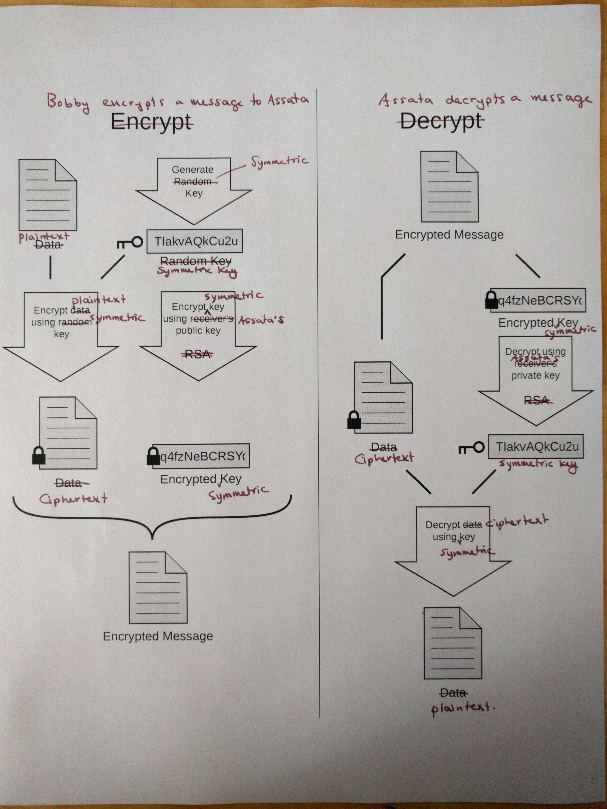

## Public Key Cryptography

> We recommend that you read about [modern cryptography](modern-cryptography.md) and [exchanging keys](key-exchange.md) before reading this section.

#### What you'll learn

1. The difference between symmetric and asymmetric key cryptography.
2. How public key cryptography works.

---

Encryption protocols can be classified by two major types.  In *symmetric key cryptography*, the key used to decrypt a message is the same as (or easy to transform from) the key used to encrypt the message.  This is the case for the basic ciphers (Caesar, Vigen&egrave;re and the one-time pad) that we described in the [What is encryption?](cryptography.md) chapter.  (There are, of course, modern symmetric key ciphers that are used, for example, to encrypt the data on your phone or computer.)  As we saw, these protocols are challenging to use for communication because you need to first find some way to privately share the key with your communication partner.  Diffie-Hellman [key exchange](key-exchange.md) gave a method for two people to generate a shared key (that can be used in a symmetric key encryption protocol) while only communicating over an insecure channel (such as the Internet).

*Asymmetric key cryptography* or *public key cryptography* solves the key sharing problem in a different way.  Rather than have one key that is used to both encrypt and decrypt, public key cryptography uses two keys, one key to encrypt (called the *public key*) and one key to decrypt (called the *private key*).  This pair of keys have the property that:
1. It is infeasible to generate the private key from the public key: the keys must be generated together.
1. A message that is encrypted by the public key can only be (feasibly) decrypted with the corresponding private key.

Suppose Bobby wants to send Assata an encrypted message.  Assata creates a private key, public key pair and sends Bobby her public key (over an insecure channel).  Bobby uses the public key to create the ciphertext and sends the ciphertext to Assata.  The ciphertext can *only* be decrypted using Assata's private key.  Even though anyone may have Assata's public key, the *only* thing that can be done with the public key is encrypt messages which can only be decrypted using Assata's private key.  Security is therefore achieved by keeping the private key private: secret and secure.

In this model, anyone can in fact publish their public key.  For example, Assata could publish her public key online so that anyone wishing to send Assata an encrypted message could encrypt that message with her public key first.  Likewise, Bobby could create his own pair of public and private keys and publish his public key online so that others could send him encrypted messages that only Bobby could decrypt with his (securely stored) private key.

### Revisiting Diffie-Hellman key exchange: public key or symmetric key cryptography?

Let's revisit Diffie-Hellman key exchange through the lens of symmetric and public key cryptography.  Recall that Assata and Bobby agree (publicly/insecurely) on a number p.  Alice picks a (secret) number a and computes p&#x2606;a to send (publicly/insecurely) to Bobby.  One could thus view a as Assata's private key and p&#x2606;a as Assata's public key, and this scheme as part of a public key protocol.  But Bobby picks his own secret number b and combines it with Assata's public key to get p&#x2606;a&#x2606;b.  Likewise Assata combines Bobby's "public key" p&#x2606;b with her own private key to get p&#x2606;b&#x2606;a.  Since p&#x2606;a&#x2606;b=p&#x2606;b&#x2606;a, Assata and Bobby have a common key to use for encryption, and they use the same key for decryption.  In this way, this is part of a symmetric key protocol.  For these reasons, Diffie-Hellman lies somewhere between public key and symmetric key cryptography.

### Combining public key and symmetric key cryptography

Public key encryption is usually more computationally expensive than symmetric key encryption.  To achieve the same security guarantees (against, for example, brute force and other attacks), public keys need to be much longer than symmetric keys.  Also, performing the encryption itself takes longer using public keys than symmetric keys.  There is also the problem that, the longer you use a key for encryption, the more ciphertext examples there are to try and use attempts at breaking the encryption (other than brute force) -- that is, keys tend to *age poorly*.

For these reasons, public keys are generally used to encrypt a symmetric key for a given (communication) *session*.  Suppose Bobby wishes to send Assata an encrypted message.  Bobby generates a symmetric encryption key k and encrypts the message with k using a symmetric cipher.  He then *encrypts k* using Assata's public key.  He sends the encrypted message and the encrypted key to Assata.  Assata decrypts the encrypted key using her private key and then uses the result to decrypt the encrypted message.

Since the public key is only used to encrypt keys (which are typically random-looking strings), the public key does not age, because methods of breaking the encryption that rely on human-language phrases would fail.  An added benefit is that if one message is successfully decrypted, that does not help in breaking the encryption of a different message, since each message is encrypted with a different key.

### In context: Anti-nuclear activism and Pretty Good Privacy

A particularly robust implementation of public-key cryptography is PGP, an acronym for the understatement "Pretty Good Privacy".  (An interoperable, free and open-source version is GPG or "GNU Privacy Guard".)  PGP encryption is most commonly used for encrypting email communications, with several plugins and email clients that support using PGP encryption.  There are a number of (synchronized) online directories of PGP keys, each associated with an email address, allowing Bobby to look up Assata's PGP key in order to send her an encrypted email.

Phil Zimmermann, a long-time anti-nuclear activist, created PGP in 1991 so similarly inclined people might securely use bulletin-board services (BBSes or Reddit of the 80s) and securely store messages.  He developed PGP as an open-source project and no license was required for its non-commercial use.  Posting it initially to a newsgroup that specialized in grassroots political organizations, mainly in the peace movement, PGP made its way to a newsgroup used to distribute source code and quickly found its way outside the United States.  Users and supporters included dissidents in totalitarian countries, civil libertarians, and cypherpunks.  However, at the time cryptosystems using keys larger than 40 bits were then considered munitions within the definition of the US export regulations.  PGP was initially designed to support 128 bit keys.  In February 1993 Zimmermann became the formal target of a criminal investigation by the US Government for "munitions export without a license".  Zimmermann challenged by publishing the entire source code of PGP in a book which was distributed and sold widely. Anybody wishing to build their own copy of PGP could cut off the covers, separate the pages, and scan them using an OCR program, creating a set of source code text files.  While the export of munitions (guns, bombs, planes, and software) was (and remains) restricted, the export of books is protected by the First Amendment.  After several years, the investigation of Zimmermann was closed without filing criminal charges against him or anyone else.

US export regulations regarding cryptography remain in force, but were liberalized substantially throughout the late 1990s. PGP encryption no longer meets the definition of a non-exportable weapon.

#### What to learn next

* [Crytographic signing.](cryptographic-signing.md)

#### External resources

* [Why I wrote PGP](https://www.philzimmermann.com/EN/essays/WhyIWrotePGP.html), Phil Zimmermann, 1999.
* [An Introduction to Public Key Cryptography and PGP](https://ssd.eff.org/en/module/introduction-public-key-cryptography-and-pgp), Electronic Frontier Foundation.
